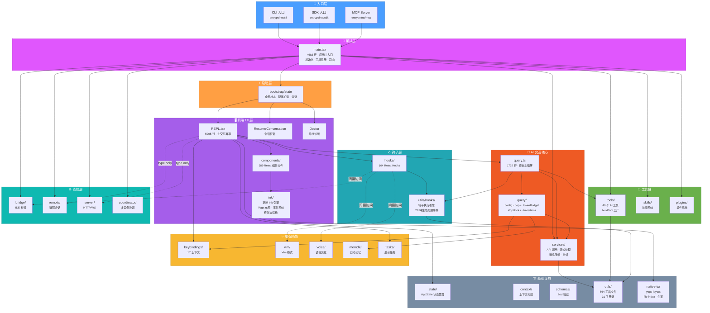
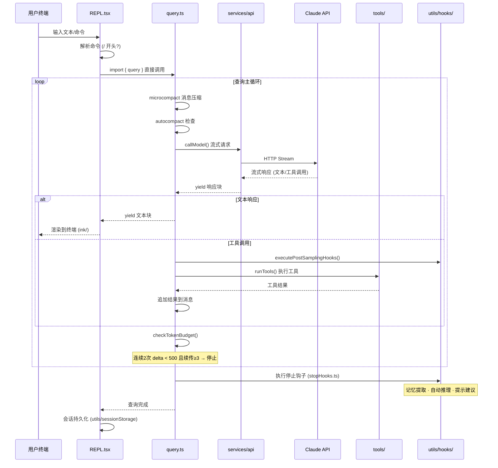
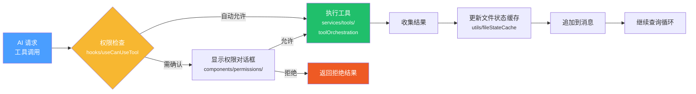
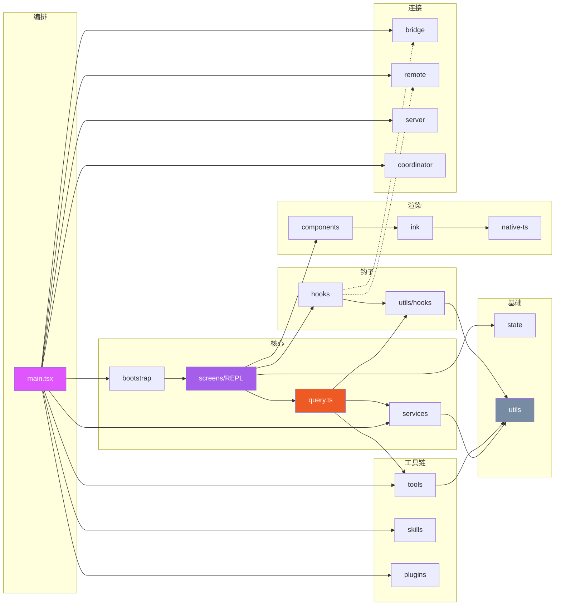
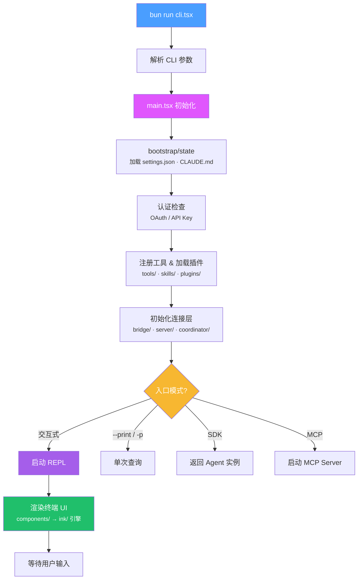

# Claude Code 源码分析 - 项目总览

## 项目概述

Claude Code 是 Anthropic 官方推出的 CLI 工具，允许用户通过终端与 Claude AI 进行交互式对话，执行软件工程任务。项目使用 TypeScript 编写，基于 React Ink 构建终端 UI，采用 Bun 作为运行时和打包工具。

## 技术栈

| 技术 | 用途 |
|------|------|
| TypeScript | 主要开发语言 |
| React + Ink | 终端 UI 框架（深度定制 Fork） |
| Bun | 运行时 & 打包工具 |
| Zod | 运行时类型校验 |
| Yoga Layout | Flexbox 布局引擎（纯 TS 简化移植） |
| OpenTelemetry | 可观测性/遥测 |
| OAuth 2.0 | 认证体系 |
| WebSocket / SSE | 实时通信 |
| MCP (Model Context Protocol) | 工具扩展协议 |

## 源码统计

- **总文件数**: 1884 个 TypeScript/TSX 文件
- **模块目录数**: 35 个顶层模块
- **根级文件数**: 18 个核心入口文件

---

## 整体架构拓扑

> 以下所有连线均基于源码 import 语句验证。实线 = 直接 import，虚线 = 间接依赖（通过 hooks 或 type-only import）。



### 架构图连线依据

| 连线 | 源码依据 |
|------|----------|
| CLI/SDK/MCP → main.tsx | 三个入口点均通过 main.tsx 启动应用 |
| main.tsx → bootstrap/ | `main.tsx:87` — `from './bootstrap/state.js'` |
| main.tsx → services/ | `main.tsx` — 多处 import analytics, api, mcp, policyLimits |
| main.tsx → tools/ | `main.tsx:45-46` — SyntheticOutputTool, AgentTool |
| main.tsx → skills/ | `main.tsx` — 直接 import skills/ |
| main.tsx → plugins/ | `main.tsx` — 直接 import plugins/ |
| main.tsx → bridge/ | `main.tsx` — 直接 import bridge/ |
| main.tsx → server/ | `main.tsx` — 直接 import server/ |
| main.tsx → coordinator/ | `main.tsx` — 直接 import coordinator/ |
| matsx → remote/ | `main.tsx` — 直接 import remote/ |
| bootstrap → screens | `REPL.tsx:32`, `Resume.tsx:6`, `Doctor.tsx:10` — 均 import bootstrap/state |
| REPL → query.ts | `screens/REPL.tsx:146` — `import { query } from '../query.js'` |
| REPL → components/ | `screens/REPL.tsx` — 14 处 import（VirtualMessageList, PromptInput 等） |
| REPL → hooks/ | `screens/REPL.tsx` — 21 处 import（useSearchInput, useTerminalSize 等） |
| REPL → state/ | `screens/REPL.tsx:170` — `import { useAppState } from '../state/AppState.js'` |
| REPL → keybindings/ | `screens/REPL.tsx` — KeybindingProviderSetup, useShortcutDisplay |
| REPL → tasks/ | `screens/REPL.tsx:44-45` — InProcessTeammateTask, LocalAgentTask |
| REPL -.- remote/ | `screens/REPL.tsx:279` — `import type { RemoteSessionConfig }` (type-only) |
| REPL -.- server/ | `screens/REPL.tsx:62` — `import type { DirectConnectConfig }` (type-only) |
| components → ink/ | 组件使用 ink/ 提供的 Box, Text 等基础组件渲染 |
| query.ts → query/ | `query.ts` — import stopHooks, config, deps, transitions, tokenBudget |
| query.ts → services/ | `query.ts:7-95` — api/withRetry, compact, toolUseSummary, analytics, tools |
| query.ts → tools/ | `query.ts:91` — `import { SLEEP_TOOL_NAME } from './tools/SleepTool/prompt.js'` |
| query.ts → utils/hooks/ | `query.ts:92-93` — postSamplingHooks, executeStopFailureHooks |
| query/ → services/ | `query/deps.ts` — api/claude, compact/autoCompact, compact/microCompact |
| query/ → memdir/ | `query/stopHooks.ts` — `import { isExtractModeActive } from '../memdir/paths.js'` |
| query/ → keybindings/ | `query/stopHooks.ts` — `import { getShortcutDisplay }` |
| hooks/ → utils/hooks/ | `hooks/useSkillImprovementSurvey.ts`, `hooks/toolPermission/PermissionContext.ts` |
| hooks/ -.- bridge/ | `hooks/useReplBridge.tsx` import bridge/ |
| hooks/ -.- vim/ | `hooks/useVimInput.ts` import vim/ |
| hooks/ -.- voice/ | `hooks/useVoiceIntegration.tsx` import voice/ |
| ink/ → native-ts/ | `ink/reconciler.ts`, `ink/ink.tsx` — import yoga-layout |
| services/tools/utils → utils/ | 多处 import utils/ 下的工具函数 |

> **REPL 不直接 import 的模块**：bridge/、vim/、voice/、memdir/、skills/、coordinator/。这些模块通过 hooks/ 间接访问，或由 main.tsx 在启动时编排。

---

## 核心数据流



---

## 工具执行流程



---

## 模块依赖关系（基于 import 验证）



---

## 启动流程



---

## 模块目录树

```
src/
├── main.tsx                    # 应用主入口 · 编排器 (4683 行)
├── Tool.ts                     # 工具工厂 buildTool() (792 行)
├── Task.ts                     # 任务类型定义 (125 行)
├── query.ts                    # 查询主循环 (1729 行)
├── QueryEngine.ts              # 查询引擎封装 (1295 行)
│
├── entrypoints/                # 入口点（CLI/SDK/MCP）
├── bootstrap/                  # 应用启动 & 全局状态
├── cli/                        # CLI 传输层 & 处理器
├── commands/                   # 86 个斜杠命令子目录 + 15 个根级命令文件
├── screens/                    # 主要 UI 屏幕（REPL/Doctor/Resume）
├── components/                 # 389 个 React UI 组件文件（31 子目录）
├── ink/                        # Ink 终端渲染引擎（深度定制 Fork）
│
├── query/                      # 查询配置/依赖注入/Token预算/停止钩子
├── services/                   # 服务层（20 子目录 + 16 根级文件 · API/分析/压缩）
├── tools/                      # 40 个 AI 工具实现
├── skills/                     # 技能系统（bundled + custom）
├── plugins/                    # 插件系统
├── hooks/                      # 104 React UI Hooks
│
├── state/                      # 应用状态管理
├── context/                    # 上下文收集（git/系统/用户）
├── constants/                  # 常量定义
├── types/                      # 全局类型定义
├── schemas/                    # Zod Schema 定义
│
├── bridge/                     # Web/IDE 桥接通信
├── coordinator/                # 多实例协调器
├── remote/                     # 远程会话管理
├── server/                     # HTTP/WebSocket 服务器
│
├── keybindings/                # 快捷键系统（17 上下文）
├── vim/                        # Vim 模式支持
├── voice/                      # 语音uddy/                      # Buddy 彩蛋（6 文件）
│
├── utils/                      # 工具函数库（564 文件 · 31 子目录）
├── native-ts/                  # 纯 TS 原生实现（yoga/file-index/色差）
├── memdir/                     # 自动记忆系统（8 文件）
├── migrations/                 # 配置迁移（11 迁移文件）
├── tasks/                      # 后台任务管理（5 种任务类型 + 根级辅助文件）
├── outputStyles/               # 输出样式加载
├── upstreamproxy/              # 上游代理
└── assistant/                  # 会话历史管理
```
