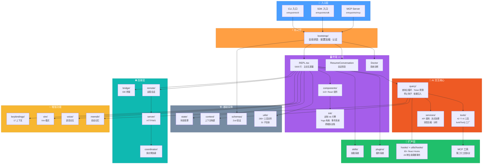
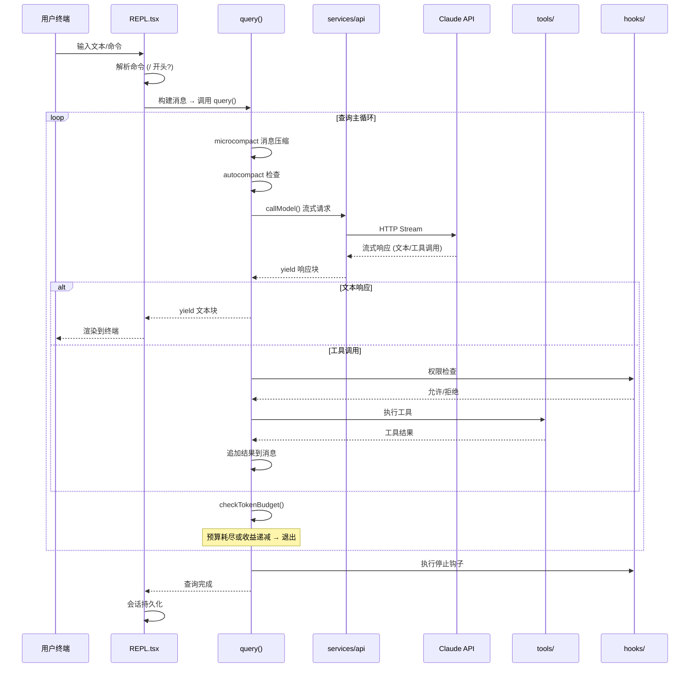
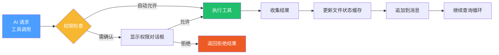
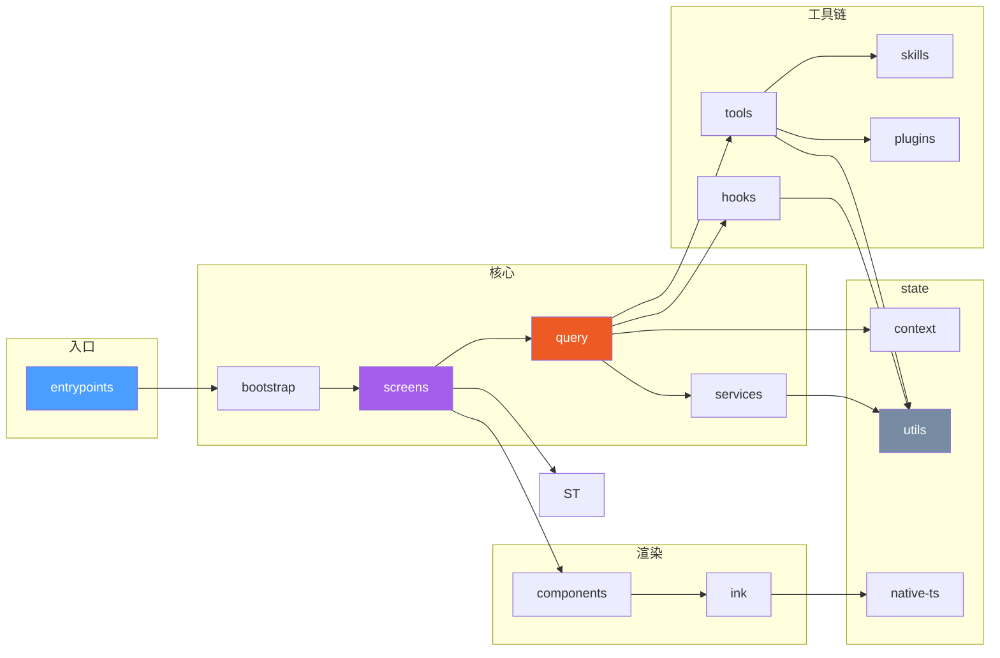

# Claude Code 源码分析 - 项目总览

## 项目概述

Claude Code 是 Anthropic 官方推出的 CLI 工具，允许用户通过终端与 Claude AI 进行交互式对话，执行软件工程任务。项目使用 TypeScript 编写，基于 React Ink 构建终端 UI，采用 Bun 作为运行时和打包工具。

## 技术栈

| 技术 | 用途 |
|------|------|
| TypeScript | 主要开发语言 |
| React + Ink | 终端 UI 框架（深度定制 Fork） |
| Bun | 运行时 & 打包工具 |
| Zod | 运行时类型校验 |
| Yoga Layout | Flexbox 布局引擎（纯 TS 简化移植） |
| OpenTelemetry | 可观测性/遥测 |
| OAuth 2.0 | 认证体系 |
| WebSocket / SSE | 实时通信 |
| MCP (Model Context Protocol) | 工具扩展协议 |

## 源码统计

- **总文件数**: 1903 个 TypeScript/TSX 文件
- **模块目录数**: 35 个顶层模块
- **根级文件数**: 18 个核心入口文件

---

## 整体架构拓扑



---

## 核心数据流



---

## 工具执行流程



---

## 模块依赖关系



---

## 启动流程

```mermaid
flowchart TB
    A["bun run cli.tsx"] --> B["解析 CLI 参数"]
    B --> C["bootstrap 初始化"]
  C --> D["加载配置<br/><small>settings.json · CLAUDE.md</small>"]
    D --> E["认证检查<br/><small>OAuth / API Key</small>"]
    E --> F["注册工具<br/><small>42 内置 + MCP 动态发现</small>"]
    F --> G["加载插件 & 技能"]
    G --> H{"入口模式?"}

    H -->|交互式| I["启动 REPL"]
    H -->|--print / -p| J["单次查询"]
    H -->|SDK| K["返回 Agent 实例"]
    H -->|MCP| L["启动 MCP Server"]

    I --> M["渲染终端 UI<br/><small>React Ink 引擎</small>"]
    M --> N["等待用户输入"]

    style A fill:#4a9eff,color:#fff
    style H fill:#f7b731,color:#fff
    style I fill:#a55eea,color:#fff
    style M fill:#20bf6b,color:#ff
---

## 模块目录树

```
src/
├── main.tsx                    # 应用主入口 (4683 行)
├── Tool.ts                     # 工具工厂 buildTool() (792 行)
├── Task.ts                     # 任务类型定义 (125 行)
├── query.ts                    # 查询主循环 (1729 行)
│
├── entrypoints/                # 入口点（CLI/SDK/MCP）
├── bootstrap/                  # 应用启动 & 全局状态
├── cli/                        # CLI 传输层 & 处理器
├── commands/                   # 86 个斜杠命令
├── screens/                    # 主要 UI 屏幕（REPL/Doctor/Resume）
├── components/                 # 110+ React UI 组件
├── ink/                        # Ink 终端渲染引擎（深度定制 Fork）
│
├── query/                      # 查询配置/依赖注入/Token预算/停止钩子
├── services/                   # 服务层（20 子目录 · API/分析/压缩）
├── tools/                      # 42 个 AI 工具实现
├── skills/                     # 技能系统（bundled + custom）
├── plugins/                    # 插件系统
├── hooks/                      # 85+ React UI Hooks
│
├── state/                      # 应用状态管理
├── context/                    # 上下文收集（git/系统/用户）
├── constants/                  # 常量定义
├── types/                      # 全局类型定义
├── schemas/                    # Zod Schema 定义
│
├── bridge/                     # Web/IDE 桥接通信
├── coordinator/                # 多实例协调器
├── rem                 # 远程会话管理
├── server/                     # HTTP/WebSocket 服务器
│
├── keybindings/                # 快捷键系统（17 上下文）
├── vim/                        # Vim 模式支持
├── voice/                      # 语音交互
├── buddy/                      # Buddy 彩蛋（6 文件）
│
├── utils/                      # 工具函数库（280+ 文件 · 31 子目录）
├── native-ts/                  # 纯 TS 原生实现（yoga/file-index/色差）
├── memdir/                     # 自动记忆系统（8 文件）
├── migrations/                 # 配置迁移（11 迁移文件）
├── tasks/                      # 后台任务管理（7 种任务类型）
├── outputStyles/               # 输出样式加载
├── upstreamproxy/          # 上游代理
└── assistant/                  # 会话历史管理
```
