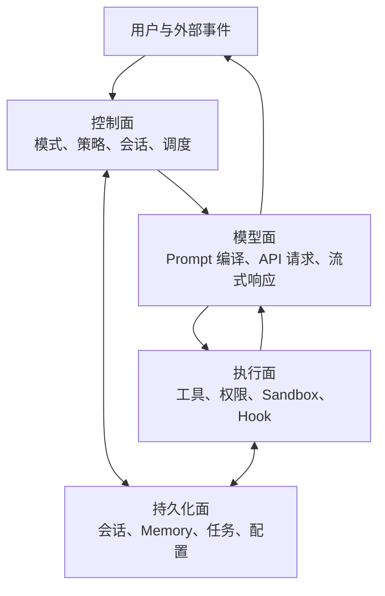
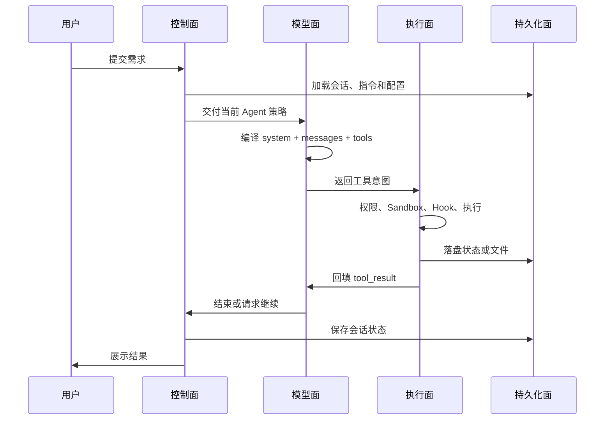

# 总体架构与四个运行平面

Claude Code 表面上是一个终端应用，架构上却更接近一个**本地 Agent 运行时**。它要同时协调模型、本地工具、安全策略、会话状态和持久化资料。

理解整个系统，最有效的方法不是记住源码目录，而是把它分成四个运行平面。

## 控制面：决定这一刻的 Agent 是谁

控制面不直接完成用户任务，而是决定任务应以什么方式运行。它维护：

- 当前是主 Agent、某种 Subagent，还是特殊协调器；
- 处于 Default、Plan、Accept Edits 还是其他权限模式；
- 使用哪个模型、思考策略和备用模型；
- 哪些工具应对当前 Agent 可见；
- 当前回合是继续、等待、压缩、恢复还是终止；
- 子 Agent、后台任务和团队消息如何调度。

可以把控制面理解为 Agent 的“操作系统内核”：它本身不写文件、不搜索代码，但决定谁可以在什么边界内做这些事。

## 模型面：把本地世界编译成请求

模型面负责两次编译：

1. **请求编译**：把系统指令、用户原话、会话历史、运行时附件和工具能力组装成 Messages API 请求。
2. **响应编译**：把模型返回的文本、思考、工具意图和停止原因，转换成本地运行时能处理的事件。

模型并不直接看到本地世界。它看到的只是被选中的 `system`、`messages`和 `tools`。本地上有一个文件，不等于该文件已经发给模型；只有它被指令加载、附件选中或工具读取后，内容才会进入请求。

## 执行面：把模型意图变成受控操作

模型返回 `tool_use` 只是表达意图。真正的本地动作由执行面完成：

- 查找对应工具并校验输入；
- 询问权限策略是允许、拒绝还是请求用户确认；
- 在需要时使用操作系统沙盒执行 Shell；
- 调用工具前后的 Hook；
- 产生进度、成功、失败或取消结果；
- 把结果封装成后续请求的 `tool_result`。

这里的重要边界是：**模型提议动作，本地运行时决定动作能否发生**。因此安全不是只靠 Prompt 中的“请勿”，还有模型之外的硬边界。

## 持久化面：保存运行所需的跨回合事实

持久化面不只是“保存聊天记录”。它还承载：

- 会话与转录；
- 用户、项目和本地配置；
- CLAUDE.md 与 Rules 这类指令文件；
- 自动 Memory、Agent Memory 和 Session Memory；
- Plan 文件、任务状态、后台 Agent 输出和团队邮箱；
- 插件、Skill、MCP 和 Hook 配置。

持久化的内容也不会全部常驻模型上下文。控制面在合适的生命周期节点选取它们，模型面再将被选中的部分编译进请求。

## 四个平面如何组成闭环

这个闭环说明了一个精妙的架构选择：**不让模型成为系统本身**。模型是决策引擎，但上下文选择、工具执行、安全边界、持久化和恢复都留在本地运行时。这使同一个模型可在不同 Agent 类型中获得不同能力，也让模型失败时仍然可以重试、降级或恢复。

## 常见误解

- **“终端 UI 就是主系统”**：UI 只是一个入口和观察面，SDK、远程、非交互会话也可驱动同一类运行时。
- **“模型知道项目里的所有事”**：模型只知道本轮被编译进请求的内容。
- **“工具调用就是远程执行”**：工具意图先回到 Claude Code，真正执行主要发生在本地或已连接的 MCP 服务器。
- **“有了 Sandbox 就不需要权限系统”**：权限决定动作是否可以发起，Sandbox 限制已允许进程的实际能力。

## 源码定位

- 主回合与控制流：`src/query.ts`、`src/query/`
- 模型 API 边界：`src/services/api/claude.ts`
- 工具集合与执行：`src/tools.ts`、`src/services/tools/`
- 权限与沙盒：`src/utils/permissions/`、`src/utils/sandbox/`
- 会话与状态：`src/state/`、`src/context.ts`、`src/services/compact/`
- 持久记忆：`src/memdir/`、`src/services/SessionMemory/`
