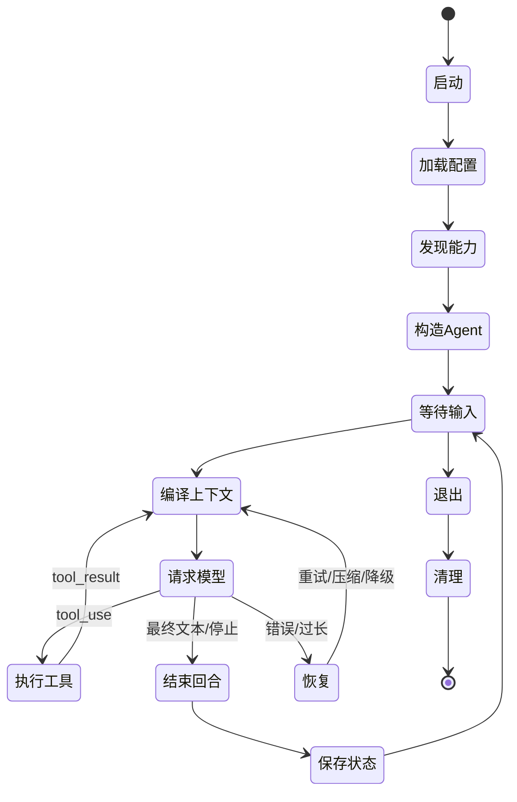

# Agent 的完整生命周期

一个 Claude Code Agent 不是每次请求都从零开始，也不是一次启动后就永久不变。它有两层生命周期：

- **会话生命周期**：从创建或恢复会话，到退出、清理或转移。
- **回合生命周期**：从收到一次用户输入，到这次任务的工具链和模型决策结束。

回合可以包含很多次 API 请求；会话又可以包含很多回合。

## 生命周期全景

## 阶段一：启动与环境建模

运行时先确定“我在哪里运行”：当前工作目录、平台、Shell、Git 状态、终端形态、交互或非交互入口、用户身份与 API 提供方。

这个阶段的输出不是一个 API 请求，而是一组后续构造 Agent 所需的环境事实。其中有些会进入 system，有些只影响本地工具和权限。

## 阶段二：加载策略与发现能力

运行时接着合并多个范围的配置和策略：托管策略、用户配置、项目配置、本地配置、命令行参数和当前会话变更。

同时发现可用能力：

- 内置工具与平台工具；
- 已连接 MCP Server 的工具、资源和 Skill；
- 项目、用户、托管和插件提供的 Skills、Agents 和 Hooks；
- CLAUDE.md、Rules、Memory 和会话记录。

“被发现”只代表候选。它们还要通过功能开关、平台、权限、Agent 类型和信任边界的筛选。

## 阶段三：构造当前 Agent

环境和候选能力就绪后，运行时才能构造当前 Agent。构造结果包含：

- 身份与专用系统提示；
- 模型、思考方式和备用策略；
- 经过裁剪的工具池；
- 用户与项目指令；
- 权限模式与硬性策略；
- 会话历史、读取缓存、取消信号和任务状态等运行时状态。

这一阶段是全书的第一条主线，后面五章会继续拆解。

## 阶段四：进入一个用户回合

收到用户输入后，运行时不会立即把原文发给 API。它还要：

1. 收集当前时刻需要附加的指令、记忆、模式和文件变化；
2. 将附件转换为内部消息；
3. 检查上下文预算，必要时先清理或压缩；
4. 归一化角色顺序和工具配对；
5. 重新完成工具池与权限状态的当前快照。

这是一个精妙的时序设计：动态事实不是在会话创建时一次性冻结，而是在每轮的正确时点重新编译。

## 阶段五：模型与工具循环

一次请求后，模型可能直接返回最终文本，也可能返回一个或多个工具调用。如果有工具，本地运行时会执行权限与工具流程，再把结果追加到历史中。

因此一个用户回合实际上是：

> 请求模型 → 解析意图 → 本地执行 → 回填结果 → 再请求模型。

它会循环到模型不再请求工具、用户中断、本地策略终止，或发生无法恢复的错误。

## 阶段六：恢复不是一条统一重试线

不同失败需要不同恢复：

- 短暂的传输或限流错误可等待后重试；
- 上下文过长需要清理、微压缩或完整压缩；
- 媒体过大需要处理特定内容，而不是盲目重发；
- 模型不可用时可切换备用模型；
- 工具失败通常作为结果返回模型，让模型决定下一步；
- 用户中断和 Hook 阻止代表控制决策，不应被自动重试抵消。

这种分流设计比“任何错误都再调一次 API”更稳健，也避免在确定性错误上重复消耗 Token。

## 阶段七：结束回合与保留连续性

当模型给出最终答复或运行时决定停止时，本轮的临时资源会被清理，但会话不一定结束。历史、任务、文件变更、Memory 和必要的会话笔记会为下一轮提供连续性。

对 Subagent 而言，结束时还要清理 Agent 局部的 Skill 调用状态、调试记录和独立取消资源，再把最终结果回传主 Agent。

## 三个容易混淆的“结束”

| 结束类型 | 结束的是什么 | 仍然保留什么 |
|---|---|---|
| 一次 API 请求结束 | 当前流式响应 | 当前用户回合可继续执行工具 |
| 一次用户回合结束 | 当前任务的工具循环 | 会话历史和持久状态 |
| 一个 Agent 结束 | 该 Agent 的独立查询链和局部资源 | 已落盘文件与回传结果 |

这个区分非常重要：“模型停止生成”不代表“本地任务已经完成”，“子 Agent 结束”也不代表“主会话结束”。

## 源码定位

- 启动与会话入口：`src/entrypoints/`、`src/bootstrap/`
- 环境与用户上下文：`src/context.ts`、`src/utils/systemPrompt.ts`
- 主回合生命周期：`src/query.ts`
- 附件与消息归一化：`src/utils/attachments.ts`、`src/utils/messages.ts`
- 错误与压缩恢复：`src/query.ts`、`src/services/compact/`
- Subagent 生命周期：`src/tools/AgentTool/`、`src/tasks/`
