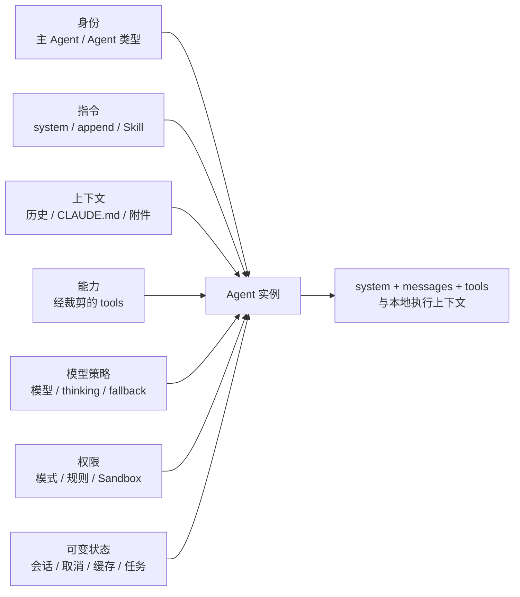

# Agent 构造公式

在 Claude Code 中，Agent 不是“一段不同的人设 Prompt”。一个可运行 Agent 至少是七个部分的组合：

> **Agent = 身份 + 指令 + 上下文 + 能力 + 模型策略 + 权限 + 可变状态**

这七部分不会被拼成一个巨大字符串。它们分布在 API 请求、本地运行时和持久化系统中。

## 身份：决定它为什么存在

身份先定义 Agent 的职责，再影响后面的指令和能力。

- **主 Agent** 承担用户会话、最终决策和结果交付。
- **Explore Agent** 主要做只读检索和代码建模。
- **Plan Agent** 主要形成方案，不应拥有普通写入能力。
- **自定义 Agent** 可以定义专用职责、指令、工具、模型、Skills、Hooks 和 MCP 需求。
- **特殊内部 Agent** 可服务于压缩、验证、会话记忆等系统任务；它们可能受功能开关或构建类型限制。

身份不是界面标签，而是能力边界的输入。例如只读 Agent 不只会在 Prompt 中收到“不要写文件”，它的工具池也会直接移除写入能力。

## 指令：定义决策规则

指令包含不同生命周期的内容：

| 指令类型 | 典型内容 | 生命周期 |
|---|---|---|
| 基础 system | 身份、安全原则、任务方法、工具使用和表达风格 | Agent 构造时选择 |
| Agent 专用指令 | 某类 Agent 的职责和边界 | 该 Agent 生命周期 |
| 附加 system | 用户显式要求附加的高层指令 | 当前会话或 Agent |
| 项目指令 | CLAUDE.md、Rules | 随工作目录和文件范围变化 |
| 运行时提醒 | Plan Mode、Skill、Memory、Hook、任务状态 | 在特定回合附加 |

这些指令并不都进入顶层 `system`。动态指令往往通过 `user` 消息中的 `<system-reminder>` 进入正确时序位置。

## 上下文：定义它此刻知道什么

上下文与指令不同。指令规定“应该怎样做”，上下文提供“当前世界是什么样”。

上下文可以来自：

- 用户原话与会话历史；
- 工具返回的文件、命令、网页和 MCP 结果；
- 当前工作目录、Git、日期、模型与平台信息；
- 项目指令、Memory、已调用 Skill 和压缩摘要；
- 子 Agent、后台任务、Hook 和 IDE 产生的事件。

上下文必须被选择。把本地所有内容都塞给模型不但不可能，还会破坏时序、缓存和注意力分配。

## 能力：定义它真正能做什么

能力由当前工具池表达，而不只是由 Prompt 声称。工具池是多个集合的交集：

> 内置与 MCP 候选 ∩ 平台与功能开关 ∩ Agent 允许范围 ∩ 权限硬规则 ∩ 当前加载状态

因此，同一模型、同一用户、同一项目，在主 Agent、Plan Agent 和后台 Agent 中也可能拥有不同能力。

## 模型策略：定义由哪个决策引擎思考

模型策略不只是一个模型名，还可包含：

- 主模型与备用模型；
- 思考模式与思考预算；
- 输出上限与结构化输出；
- 快速模式、模型可用性和提供方适配；
- 某些特殊 Agent 使用的专用模型。

条件启用的 Agent 还可为自己指定模型或推理力度。但提供方、账户策略和当前模型可用性仍是外层约束。

## 权限：定义能力在什么条件下可以使用

工具存在不等于任何参数都能执行。权限是一个独立的运行时输入：

- 权限模式给出默认决策风格；
- 托管、用户、项目和会话规则给出允许、询问和拒绝范围；
- 工具对参数做语义分析，例如命令、路径或域名；
- Sandbox 对已被允许的进程继续加上操作系统边界。

权限主要留在本地，不会作为一个顶层 API 字段交给模型。

## 可变状态：让 Agent 不是一次性函数

最后一部分是模型请求之外的可变状态：

- 当前会话、历史和压缩边界；
- 当前权限模式、模型和工具池；
- 读取文件缓存、文件变化和工具追踪；
- 取消信号、后台任务、队友消息和通知；
- 已调用 Skills、连续失败、备用模型和压缩跟踪。

它们决定了“下一次请求怎样构造”，却不一定以原始形式发给模型。

## 构造不是一次性完成

Agent 构造有两个时间尺度：

1. **初始构造**：选择身份、system、模型、初始工具和会话状态。
2. **回合重建**：根据新的权限模式、已加载工具、附件、压缩结果、文件变化和子 Agent 消息更新请求快照。

这是 Agent 构造最精妙的地方之一：**身份相对稳定，能力和上下文按回合编译**。这既保持行为一致，又允许它在 Plan Mode、Skill 调用、ToolSearch 加载和压缩后更新能力。

## 源码定位

- Agent 定义与内置类型：`src/tools/AgentTool/`、`src/commands/agents/`
- 系统提示选择：`src/utils/systemPrompt.ts`、`src/constants/prompts.ts`
- 用户与运行时上下文：`src/context.ts`、`src/utils/attachments.ts`
- 工具池组装与裁剪：`src/tools.ts`、`src/tools/AgentTool/agentToolUtils.ts`
- 查询期间的可变状态：`src/query.ts`、`src/types/`
