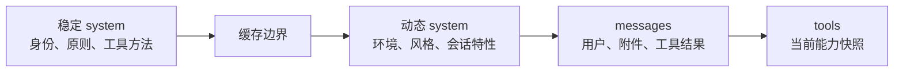

# 系统 Prompt 的分层与选择

Claude Code 的 Prompt 不是一篇永远不变的长文，也不是每轮把所有信息重新拼成一个字符串。它是一套带有选择优先级、分块和缓存边界的指令系统。

## 先区分四条 Prompt 通道

| 通道 | API 位置 | 承载的内容 |
|---|---|---|
| 基础行为 | 顶层 `system[]` | Agent 身份、安全原则、任务方法、工具原则、风格和环境 |
| 对话与运行时事实 | `messages[]` | 用户原话、历史、工具结果、CLAUDE.md、Plan、Skill、Memory、Hook |
| 能力说明 | 顶层 `tools[]` | 工具名、用途、输入结构与缓存标记 |
| 推理与输出控制 | 请求顶层字段 | 模型、思考、输出上限、工具选择和实验能力 |

四条通道共同影响模型，但生命周期不同。把它们区分开，才能同时保持指令稳定、时序正确和缓存有效。

## system 的选择优先级

系统提示词不是把所有候选顺序叠加。它先选择一个基础，再决定是否追加补充内容。优先级大致是：

1. **完整覆盖**：使用者或特殊入口提供一份完整 system，默认 system 不再加入。
2. **协调器模式**：特殊协调场景使用独立职责提示。
3. **Agent 专用提示**：当前 Agent 定义有自己的 system，使用它代替主 Agent 默认提示。
4. **命令行自定义提示**：使用显式提供的基础提示。
5. **Claude Code 默认提示**：没有更高优先级选择时使用。

附加提示通常放在已选基础 system 之后。但“完整覆盖”的意义就是替换，不再悄悄混入默认行为。

## 默认 system 不是一块内容

默认 system 可以按职责理解为下列区段：

1. Agent 身份与基本安全原则；
2. 如何理解并完成软件工程任务；
3. 如何对待高风险、不可逆和对外可见操作；
4. 如何优先使用专用工具、并行工具和任务跟踪；
5. 何时使用 Subagent 与 Skill；
6. 如何组织面向用户的最终表达；
7. 会话级能力和自动 Memory 规则；
8. 工作目录、Git、平台、Shell、模型等环境信息；
9. 可选的语言、输出风格、MCP 指令、临时目录与上下文管理说明。

某一段是否出现，可能取决于工具集、模型、平台、输出风格、功能开关或运行入口。因此不存在一份永远字节级相同的默认 Prompt。

## 稳定内容与动态内容的缓存边界

系统 Prompt 最精妙的设计之一，是不只考虑“模型要看什么”，还考虑“哪些前缀可被缓存复用”。

相对稳定的行为原则放在前面，易变的用户、项目和回合信息放在后面或 `messages`。当用户再说一句话、Plan Mode 变化或文件更新时，不必让整个基础 Prompt 失去缓存。

这个设计的代价是上下文不再是一段可直观阅读的大文本，而是需要经过编译的分块协议。

## 为什么 `<system-reminder>` 不放在 system

Plan Mode、CLAUDE.md、Skill、Memory 和 Hook 等内容对模型有指令意义，但它们常常必须出现在特定时点。如果全部放进顶层 system：

- 无法表达“调用 EnterPlanMode 之后才生效”；
- 难以和工具结果保持正确时序；
- 动态变化会频繁破坏前缀缓存；
- 压缩后难以按仍有效的状态重建。

因此它们先成为运行时附件，再作为 `user.content[]` 中的文本块进入消息。`<system-reminder>` 只是 Claude Code 与模型之间的内部语义标签，不是 Messages API 新的角色。

## 工具说明为什么不应塞进 system

工具的名称、用途和输入结构是结构化 Prompt，它们位于 `tools[]`。这样模型可以产生可校验的 `tool_use`，运行时也可以对工具做增删和延迟加载。

如果工具只是 system 里的一段文字，模型可能理解用途，却没有可靠的参数协议，本地运行时也难以把“能力可见”变成硬性边界。

## 普通 Subagent 与 Fork 的 Prompt 差异

- **普通 Subagent** 使用该 Agent 类型自己的 system，并从委派 Prompt 开始一条新消息链。
- **Fork** 为了复用 Prompt 缓存，可以继承已经渲染的 system、主对话前缀和精确工具数组。

这说明 Prompt 本身也是多代理隔离的一部分。普通 Subagent 优先上下文独立，Fork 优先前缀复用；两者不应被视为同一种启动方式。

## 常见误解

- **“所有指令都在 system”**：运行时指令大量存在于带内部标签的 `user` 内容。
- **“system-reminder 比 user 角色优先级高”**：在 API 协议中它仍是 user 文本块；特殊性来自模型与 Claude Code 对该标签的协议理解。
- **“主 Agent 和 Subagent 只是 user Prompt 不同”**：它们的 system、tools、模型策略和可变状态都可能不同。
- **“追加 Prompt 等于完整覆盖”**：前者保留基础行为，后者替换基础行为。

## 源码定位

- 默认 system 区段：`src/constants/prompts.ts`、`src/constants/systemPromptSections.ts`
- system 选择优先级：`src/utils/systemPrompt.ts`
- system 分块与 API 转换：`src/utils/systemPromptType.ts`、`src/services/api/claude.ts`
- 运行时附件：`src/utils/attachments.ts`
- Fork 前缀复用：`src/tools/AgentTool/forkSubagent.ts`、`src/utils/forkedAgent.ts`
