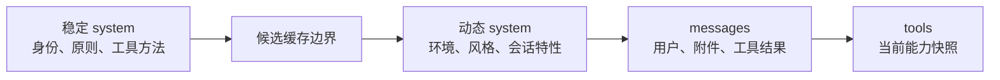

# 系统 Prompt 的分层与选择

Claude Code 的 Prompt 不是一篇永远不变的长文，也不是每轮把所有信息重新拼成一个字符串。它是一套带有选择优先级、分块和缓存边界的指令系统。

## 先区分四条 Prompt 通道

| 通道 | API 位置 | 承载的内容 |
|---|---|---|
| 基础行为 | 顶层 `system[]` | Agent 身份、安全原则、任务方法、工具原则、环境、自动 Memory 机制；Agent 自身的 Memory 规则与内容也可追加在这里 |
| 对话与运行时事实 | `messages[]` | 用户原话、历史、工具结果、初始 CLAUDE.md / 日期，以及按时序出现的 Plan、相关或嵌套 Memory、Skill、Hook 等提醒 |
| 能力说明 | 顶层 `tools[]` | 工具名、用途、输入结构与缓存标记 |
| 推理与输出控制 | 请求顶层字段 | 模型、思考、输出上限、工具选择和实验能力 |

四条通道共同影响模型，但生命周期不同。把它们区分开，才能同时保持指令稳定、时序正确和缓存有效。

## 交互主线的 system 选择树

系统提示词不是把所有候选顺序叠加，而是先选择基础，再决定是否追加。交互主线的选择树是：

1. **完整覆盖接口**：如果内部入口真的传入 override，直接使用它，不再追加其他 system。当前源码能确认这条选择接口存在，但不能据此宣称普通用户入口一定会触发它。
2. **协调器提示**：只有协调条件成立，并且没有主线程 Agent 定义时才选择。
3. **主线程 Agent 提示**：有主线程 Agent 定义时采用该 Agent 的提示。Proactive / KAIROS 是特例：Agent 指令追加到默认提示，而不是替换默认提示。
4. **命令行自定义提示**：没有以上分支时，显式自定义基础提示胜出。
5. **默认提示**：其余情况使用 Claude Code 默认提示。

普通 append system 放在已选基础之后；完整覆盖分支则不追加。这里的精妙之处不是优先级数字，而是**互斥选择、条件例外和追加语义被明确分开**。

## Headless / SDK 有自己的选择顺序

非交互入口不是机械复用交互 REPL 的优先级。在 Headless / SDK 路径中，显式 system prompt 高于 Agent prompt；只有没有显式 system 时，才回退到 Agent 或默认提示。

因此，“自定义 Agent 一定覆盖显式 system”或“所有入口都遵循同一优先级”都不成立。架构上共享的是 system 的分块协议，不是每个入口的产品选择策略。

## 默认 system 不是一块内容

默认 system 可以按职责理解为下列区段：

1. Agent 身份与基本安全原则；
2. 如何理解并完成软件工程任务；
3. 如何对待高风险、不可逆和对外可见操作；
4. 如何优先使用专用工具、并行工具和任务跟踪；
5. 何时使用 Subagent 与 Skill；
6. 如何组织面向用户的最终表达；
7. 会话级能力和自动 Memory 规则；
8. 工作目录、Git、平台、Shell、模型等环境信息；
9. 可选的语言、输出风格、MCP 指令、临时目录与上下文管理说明。

某一段是否出现，可能取决于工具集、模型、平台、输出风格、功能开关或运行入口。因此不存在一份永远字节级相同的默认 Prompt。

## 内容顺序稳定，但全局缓存边界有条件

系统 Prompt 最精妙的设计之一，是不只考虑“模型要看什么”，还考虑“哪些前缀可被缓存复用”。

相对稳定的行为原则放在前面，易变的用户、项目和回合信息放在后面或 `messages`。这是始终成立的**内容排序原则**。

但“稳定段一定进入跨组织共享的全局缓存”并不成立。物理缓存作用域还取决于：基础提示是否带有默认提示的稳定标记、调用是否具备第一方全局缓存资格，以及渲染后的非延迟用户 MCP 工具是否迫使缓存降级。自定义提示或 Agent 提示通常没有默认标记；第三方资格、标记缺失或用户 MCP 也可能只使用组织级缓存。

因此要区分两件事：**把稳定内容放在前面**是 Prompt 架构；**这段前缀最终使用哪一级缓存**是请求时策略。前者为后者创造机会，但不保证结果。

这个设计的代价是上下文不再是一段可直观阅读的大文本，而是需要经过编译的分块协议。

## `<system-reminder>` 是消息内协议，不是唯一注入通道

源码中至少有三条不同路径，不能把所有动态知识都概括成“先变成附件”：

1. **初始 user context**：CLAUDE.md 层级与日期在会话开始时直接组成靠前的 meta `user` 消息。
2. **system 绑定内容**：自动 Memory 的使用机制属于默认顶层 system；Agent 自身的 Memory 规则和已加载内容可追加到 Agent system。
3. **运行时附件**：Plan 状态、后续路径指令、相关或嵌套 Memory、Skill、Hook、文件变化等在发生时转成消息内提醒。

这些内容都有指令意义，但时序不同。如果把动态部分全部放进顶层 system：

- 无法表达“调用 EnterPlanMode 之后才生效”；
- 难以和工具结果保持正确时序；
- 动态变化会频繁破坏前缀缓存；
- 压缩后难以按仍有效的状态重建。

运行时附件通常投影为 `user.content[]` 中的文本块；如果它紧随一批工具结果，还可能折入相邻 `tool_result.content`，以保持工具配对合法，而不是永远形成独立消息。`<system-reminder>` 只是 Claude Code 与模型之间的内部语义标签，不是 Messages API 新角色，也不改变底层 role。

## 工具说明为什么不应塞进 system

工具的名称、用途和输入结构是结构化 Prompt，它们位于 `tools[]`。这样模型可以产生可校验的 `tool_use`，运行时也可以对工具做增删和延迟加载。

如果工具只是 system 里的一段文字，模型可能理解用途，却没有可靠的参数协议，本地运行时也难以把“能力可见”变成硬性边界。

## 普通 Subagent 与 Fork 的 Prompt 差异

- **普通 Subagent** 使用该 Agent 类型自己的 system，并从委派 Prompt 开始一条新消息链。
- **Fork** 在构建能力开启、交互入口且非协调器场景中，为了复用 Prompt 缓存，可以继承已经渲染的 system、主对话前缀和精确工具数组；它不是所有运行形态都存在的通用分支。

这说明 Prompt 本身也是多代理隔离的一部分。普通 Subagent 优先上下文独立，Fork 优先前缀复用；两者不应被视为同一种启动方式。

## 常见误解

- **“所有指令都在 system”**：运行时指令大量存在于带内部标签的 `user` 内容。
- **“system-reminder 比 user 角色优先级高”**：在 API 协议中它仍是 user 文本块；特殊性来自模型与 Claude Code 对该标签的协议理解。
- **“主 Agent 和 Subagent 只是 user Prompt 不同”**：它们的 system、tools、模型策略和可变状态都可能不同。
- **“追加 Prompt 等于完整覆盖”**：前者保留基础行为，后者替换基础行为。

## 源码定位

- 默认 system 区段：`src/constants/prompts.ts`、`src/constants/systemPromptSections.ts`
- system 选择优先级：`src/utils/systemPrompt.ts`
- system 分块与 API 转换：`src/utils/systemPromptType.ts`、`src/services/api/claude.ts`
- 运行时附件：`src/utils/attachments.ts`
- Fork 前缀复用：`src/tools/AgentTool/forkSubagent.ts`、`src/utils/forkedAgent.ts`
