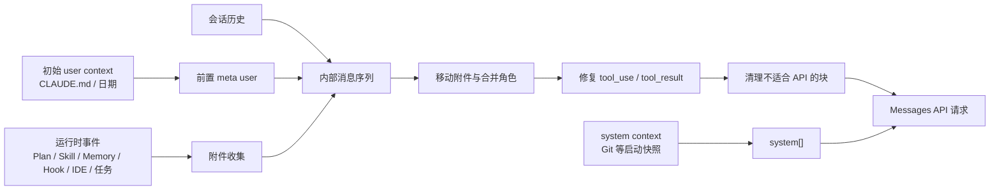

# 上下文编译

Claude Code 不是把本地世界直接暴露给模型，而是先把分散的事实编译成一个合法、有时序、可压缩的消息序列。

这个过程可以称为**上下文编译**。它介于本地状态与 Messages API 之间，是 Claude Code 最核心的架构边界之一。

## 上下文不是一个数组，而是多种信息源

| 来源 | 解决的问题 | 常见进入方式 |
|---|---|---|
| 用户原话 | 这一轮要完成什么 | 普通 `user` 内容 |
| 会话历史 | 前面做过什么、模型曾说什么 | `user` / `assistant` 交替历史 |
| CLAUDE.md 与 Rules | 用户、项目和路径级规则 | `<system-reminder>` |
| 工具结果 | 本地世界的新观测 | `tool_result` |
| Plan、Skill、相关或嵌套 Memory | 当前工作方式、专用流程和按时点激活的跨会话事实 | meta `user` 消息或相邻工具结果中的提醒 |
| Hook、IDE、文件变化 | 运行中新出现的本地状态 | 动态附件 |
| 任务和 Agent 消息 | 后台任务、队友或子 Agent 的进展 | 通知或任务附件 |

不同来源的信任程度不同。项目指令可能是受信任配置，MCP 或网页内容则是外部输入。编译的任务是放到正确位置，不是把所有文本都提升成同等权威。

## user context 与 system context 是两条通道

Claude Code 在会话中区分两类背景信息：

- **user context** 主要包含 CLAUDE.md 层级和当前日期等面向对话的事实。它被包成 `<system-reminder>`，放在消息历史前部。
- **system context** 主要包含会话启动时的 Git 状态等环境快照。它被附加到系统 Prompt。

两者都影响 Prompt 缓存，但在线上位置不同。不同入口也可以有不同策略：例如完整自定义 system 的 SDK 场景可以跳过默认 system context，却仍然保留 user context。

## CLAUDE.md 是按路径逐步激活的

指令加载不是“启动时扫描整个磁盘”。

- 托管、用户、项目和本地范围的 CLAUDE.md 会按层级组合；
- 当 Agent 进入更深目录、读取某个文件或触发路径规则时，可以加入更具体的指令；
- 只读 Explore/Plan Agent 在条件启用的瘦身策略下，可移除 CLAUDE.md 和启动 Git 快照，但不等于没有任何日期或环境上下文。

这是一种渐进式上下文设计：指令随 Agent 的实际工作范围展开，不在一开始浪费上下文窗口。

## 附件是一套运行时事件协议

“附件”不只指用户上传的文件。它是 Claude Code 用来向对话注入动态事件的统一中间形态。

可以把附件分成三层：

1. **用户触发附件**：`@file`、MCP resource、`@agent` 和条件启用的 Skill 发现。
2. **Agent 线程附件**：日期变化、工具变化、文件变化、嵌套 Memory、Plan、Todo，以及按 `agentId` 发给当前普通 Agent 的待处理消息。
3. **团队条件附件**：只有 Agent Teams 与对应 query 条件成立时，才加入 teammate mailbox 和 team context。
4. **主线专用附件**：IDE 选区、诊断、输出风格、统一任务、Token 预算和某些验证提醒。

附件提供者之间尽量隔离：一个次要附件失败，不应阻塞整个用户回合。收集本身也有时间边界，避免某个外部来源无限拖延首次模型请求。

## 时序决定附件放在哪里

首轮用户附件可以跟随用户原话进入消息。但工具回合中的新附件必须等本批工具结果收齐后才能追加。

原因不是 UI 编排，而是 Messages API 的对话协议：一组 `tool_use` 需要紧随可配对的 `tool_result`，不能在中间随意插入一条普通用户消息。

后台命令队列也按 Agent 身份分流：主 Agent 只消费主线用户输入，Subagent 只消费发给自己的任务通知，不会偷走用户给主线的新 Prompt。

## 内部 transcript 不等于 API messages

为了 UI、恢复和审计，内部 transcript 可以保留：

- 进度消息；
- 附件消息；
- 本地命令输出；
- 被拆成多块的流式 assistant 响应；
- 不需要发给模型的虚拟与展示消息。

请求前才会把它们投影成 API messages。这个投影是有损的：

1. 附件被移到合法时序位置；
2. 纯 UI 进度和虚拟消息被过滤；
3. 连续 `user` 消息被合并，以适配要求角色交替的提供方；
4. 同一次 API 响应的 assistant 分块被重新合并；
5. 工具名和工具输入被归一化；
6. 孤立思考块、空 assistant、非法媒体和不配对的工具结果被清理或修复。

这种分离非常精妙：**transcript 优先保留运行真相，API projection 优先满足协议和缓存稳定**。如果强迫两者共用一种消息形状，UI、恢复和模型协议会相互牵制。

## 日期变化展示了上下文编译的核心思想

会话首次的日期会被保持，跨过零点时不会回头改写对话前部的日期。新日期作为对话尾部的变化附件进入。

这样既保留“时间已经变化”的语义，又不会改写整段旧历史并让 Prompt cache 失效。上下文编译的目标不仅是信息正确，还是在正确时点以稳定前缀表达信息。

## 源码定位

- user/system context：`src/context.ts`、`src/utils/api.ts`
- 用户输入处理：`src/utils/processUserInput/`
- 附件收集与转换：`src/utils/attachments.ts`
- API 消息投影：`src/utils/messages.ts`、`src/services/api/claude.ts`
- 主回合中的附件时序：`src/query.ts`
