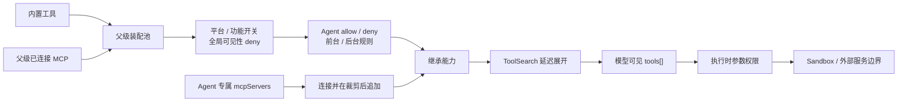

# 工具能力图

模型能否读文件、运行命令或创建 Subagent，不是由一句“你可以”决定的，而是由当前请求的 `tools[]` 与本地执行策略共同决定。

因此，工具不是一张静态清单，而是一张会随 Agent、平台、权限和运行状态变化的**能力图**。

## 工具能力有两条装配路径

### 第一层：候选来源

父级候选池主要由内置工具与已经连接的 MCP 工具组成。通常模式下，MCP 能力以 `mcp__服务名__工具名` 暴露；SDK 的 no-prefix 模式是明确例外，因此不能靠名称格式识别所有 MCP 工具。

父级装配池会把内置与 MCP 分区稳定排序，内置工具在前。这不只是为了美观：新增 MCP 工具时，尽量不打乱内置工具的字节前缀。Agent 专属 MCP 在裁剪后直接追加，并不会再次执行这套分区排序，所以排序是装配池的规律，不是所有最终 Agent 工具数组的绝对规律。

### 第二层：运行环境

工具可能因下列原因不进入候选：

- 当前平台不支持，例如特定 Shell 工具；
- 功能开关或内部构建未开启；
- 非交互或简化运行形态不需要该能力；
- MCP Server 尚未连接、尚未认证或没有提供工具。

因此“源码目录里有这个工具”不能证明它已经出现在当前请求中。

### 全局可见性与执行时 deny

明确禁止的工具可在请求前直接从能力图移除。这样模型不会先决定调用一个注定被拒绝的能力，也减少了无意义的工具协议开销。

参数级权限则不能全在这里处理。例如 Bash 可能允许某些命令而禁止另一些；这种判断必须等模型给出具体输入后再做。

### Agent 自身的允许与禁止

Agent 定义可以提供工具白名单或禁止列表。但主线 Agent 与普通 Subagent 的语义并不完全相同：

- 作为主线启动的 Agent 保留主会话运行能力，再应用自身 allow/deny；
- 普通 Subagent 会先移除子 Agent 全局禁止能力，然后应用自身规则；
- `permissionMode=plan` 只让 `ExitPlanMode` 越过普通 Subagent / 后台默认裁剪，并不会自动移除写工具；
- 内置 Plan Agent 是另一层身份策略：它通过自身禁止列表同时移除写工具与 `ExitPlanMode`，因为它只负责形成方案，不能自行退出主线的 Plan Mode；
- Fork 仅在对应能力与入口条件成立时，为保持缓存字节一致而精确复用父线程工具数组，递归限制改在调用时检查。

这说明“Agent 类型”不只改变 Prompt，还参与实际能力裁剪。

继承父级装配池、且名称以 `mcp__` 开头的 MCP 工具有一个窄特例：它们越过普通 Subagent 默认禁用表和后台异步白名单，但**仍受该 Agent 的 `tools` / `disallowedTools` 裁剪**。SDK no-prefix MCP 不会命中这项名称特例。

### 前台与后台调度边界

后台 Agent 不能依赖随时弹出的主 UI 对话。它的工具池因此会再收紧，例如避免直接向用户提问、操作主线 Plan Mode 或不受控地继续生成子 Agent。

条件启用的进程内队友可以获得部分团队工具和同步委派能力，但仍会防止无限后台扩张。

### Agent 专属 MCP 是后置增量

Agent 可以在父级 MCP 能力之外声明自己需要的 MCP Server：

- 对已存在的全局连接，可以复用；
- 对 Agent 自己创建的动态连接，应在 Agent 结束时清理；
- 要求必备 MCP 的 Agent，只有在对应 Server 已真正提供工具时才应可用；
- 用户控制的 Agent 配置不能在严格信任策略下悄悄引入任意 MCP。

这条路径发生在 `resolveAgentTools` 之后，所以新追加的专属 MCP 不再经过该 Agent 的 allow/deny，也不再经过父级装配池此前的 blanket-deny 可见性过滤。这不等于获得无条件执行权：具体调用仍要经过运行时权限与 deny。**可见性后置追加和执行授权是两套边界。**

### ToolSearch 的延迟暴露

延迟加载并不只在“工具很多”时发生。默认策略会优先把多数 MCP / `shouldDefer` 工具设为 deferred，`alwaysLoad` 可使其常驻；只有 auto 模式才主要依据工具规模阈值决定是否启用。最终选择还受模型、提供方、功能开关和当前可见性影响。

模型初始只知道延迟工具的名称与可发现性，使用 ToolSearch 返回引用后，对应完整输入结构才进入后续请求。

工具能力图因此不仅是“有／无”，还有“可发现但尚未展开”状态。

## 工具定义和本地工具不是同一个东西

模型看到的工具是一份协议：

- 名称；
- 用途说明；
- JSON 输入结构；
- 可选的延迟加载与缓存标记。

本地运行时则还持有：

- 输入归一化和验证；
- 权限决策；
- 执行器；
- 并发安全性和取消语义；
- 进度、结果和上下文更新规则。

模型看到的只是“对外协议”，不是本地实现和安全策略本身。

## 可见性与授权必须分开

工具可见性回答“模型能不能提议使用”。执行时权限回答“这一次具体输入能不能发生”。

一个 Bash 工具可以对模型可见，但一条具体命令仍可被自动允许、要求用户确认或直接拒绝。如果被允许，它还可能被 Sandbox 限制文件和网络范围。

这是工具能力图最重要的设计取舍：**用粗粒度可见性减少无效决策，用细粒度权限保留同一工具的灵活性**。

## 源码定位

- 内置与 MCP 工具池：`src/tools.ts`
- Agent 工具裁剪：`src/tools/AgentTool/agentToolUtils.ts`、`src/constants/tools.ts`
- Agent 专属 MCP：`src/tools/AgentTool/runAgent.ts`、`src/tools/AgentTool/loadAgentsDir.ts`
- ToolSearch 与延迟工具：`src/tools/ToolSearchTool/`、`src/utils/toolSearch.ts`
- API 工具投影与 schema 缓存：`src/utils/api.ts`、`src/utils/toolSchemaCache.ts`
- 执行时权限：`src/utils/permissions/`、`src/services/tools/`
