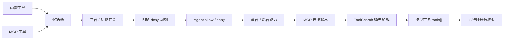

# 工具能力图

模型能否读文件、运行命令或创建 Subagent，不是由一句“你可以”决定的，而是由当前请求的 `tools[]` 与本地执行策略共同决定。

因此，工具不是一张静态清单，而是一张会随 Agent、平台、权限和运行状态变化的**能力图**。

## 一个工具从源码到模型要经过七层

### 第一层：候选来源

候选池主要由内置工具与 MCP 工具组成。内置工具有本地执行器；MCP 工具来自已连接的外部 Server，每个真实能力都是一个独立的 `mcp__服务名__工具名`。

内置与 MCP 工具会分区稳定排序，内置工具始终在前。这不只是为了美观：新增 MCP 工具时，不会打乱前面内置工具的字节顺序，可以保留更稳定的 Prompt cache 前缀。

### 第二层：运行环境

工具可能因下列原因不进入候选：

- 当前平台不支持，例如特定 Shell 工具；
- 功能开关或内部构建未开启；
- 非交互或简化运行形态不需要该能力；
- MCP Server 尚未连接、尚未认证或没有提供工具。

因此“源码目录里有这个工具”不能证明它已经出现在当前请求中。

### 第三层：硬性 deny 规则

明确禁止的工具可在请求前直接从能力图移除。这样模型不会先决定调用一个注定被拒绝的能力，也减少了无意义的工具协议开销。

参数级权限则不能全在这里处理。例如 Bash 可能允许某些命令而禁止另一些；这种判断必须等模型给出具体输入后再做。

### 第四层：Agent 自身的允许与禁止

Agent 定义可以提供工具白名单或禁止列表。但主线 Agent 与普通 Subagent 的语义并不完全相同：

- 作为主线启动的 Agent 保留主会话运行能力，再应用自身 allow/deny；
- 普通 Subagent 会先移除子 Agent 全局禁止能力，然后应用自身规则；
- Plan 类 Agent 可能保留特殊的退出计划能力，但移除普通写入；
- Fork 为了保持缓存字节一致，精确复用父线程的工具数组，递归限制改在调用时检查。

这说明“Agent 类型”不只改变 Prompt，还参与实际能力裁剪。

当前源码快照还有一个需要明说的边界：已进入子 Agent 工具集的 MCP 工具，在 Agent 自身 allow/deny 这一层直接保留；它们仍受更外层的 MCP 连接、全局 deny 和执行权限约束。因此不能笼统地说“Agent 的本地工具白名单会同样过滤所有 MCP 工具”。

### 第五层：前台与后台调度边界

后台 Agent 不能依赖随时弹出的主 UI 对话。它的工具池因此会再收紧，例如避免直接向用户提问、操作主线 Plan Mode 或不受控地继续生成子 Agent。

条件启用的进程内队友可以获得部分团队工具和同步委派能力，但仍会防止无限后台扩张。

### 第六层：Agent 专属 MCP

Agent 可以在父级 MCP 能力之外声明自己需要的 MCP Server：

- 对已存在的全局连接，可以复用；
- 对 Agent 自己创建的动态连接，应在 Agent 结束时清理；
- 要求必备 MCP 的 Agent，只有在对应 Server 已真正提供工具时才应可用；
- 用户控制的 Agent 配置不能在严格信任策略下悄悄引入任意 MCP。

MCP 是工具来源的扩展，不会跳过 Agent 裁剪和执行时权限。

### 第七层：ToolSearch 的延迟暴露

当工具很多时，可以把某些工具标记为延迟加载。模型初始只知道它们的名称和可发现性，使用 ToolSearch 后，对应工具的完整输入结构才进入后续请求。

工具能力图因此不仅是“有／无”，还有“可发现但尚未展开”状态。

## 工具定义和本地工具不是同一个东西

模型看到的工具是一份协议：

- 名称；
- 用途说明；
- JSON 输入结构；
- 可选的延迟加载与缓存标记。

本地运行时则还持有：

- 输入归一化和验证；
- 权限决策；
- 执行器；
- 并发安全性和取消语义；
- 进度、结果和上下文更新规则。

模型看到的只是“对外协议”，不是本地实现和安全策略本身。

## 可见性与授权必须分开

工具可见性回答“模型能不能提议使用”。执行时权限回答“这一次具体输入能不能发生”。

一个 Bash 工具可以对模型可见，但一条具体命令仍可被自动允许、要求用户确认或直接拒绝。如果被允许，它还可能被 Sandbox 限制文件和网络范围。

这是工具能力图最重要的设计取舍：**用粗粒度可见性减少无效决策，用细粒度权限保留同一工具的灵活性**。

## 源码定位

- 内置与 MCP 工具池：`src/tools.ts`
- Agent 工具裁剪：`src/tools/AgentTool/agentToolUtils.ts`、`src/constants/tools.ts`
- Agent 专属 MCP：`src/tools/AgentTool/runAgent.ts`、`src/tools/AgentTool/loadAgentsDir.ts`
- ToolSearch 与延迟工具：`src/tools/ToolSearchTool/`、`src/utils/toolSearch.ts`
- API 工具投影与 schema 缓存：`src/utils/api.ts`、`src/utils/toolSchemaCache.ts`
- 执行时权限：`src/utils/permissions/`、`src/services/tools/`
