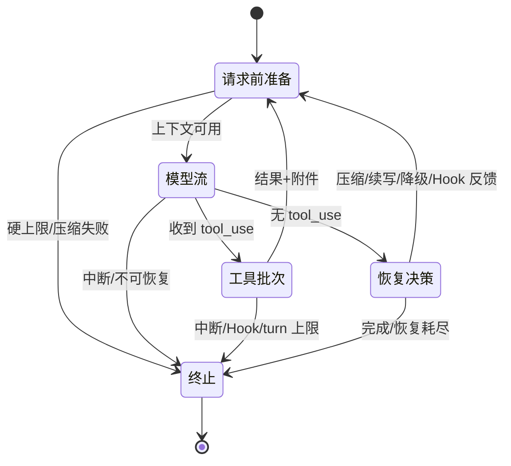

# 主查询循环

Claude Code 的核心不是“向模型发一次请求”，而是一个显式的状态机。它在一个用户回合内可以多次调用 API、执行工具、吸收新附件、压缩历史并恢复错误。

## 三层循环嵌套

| 层 | 负责什么 | 持续多久 |
|---|---|---|
| 会话宿主 | 接收输入、串行化用户回合、保存 transcript、向 UI 或 SDK 输出事件 | 整个会话 |
| Agent 查询循环 | 管理一个 agentic turn 中的多次 API、工具、压缩、Hook 和终止 | 一次用户回合 |
| Messages API 请求 | 编译一份 payload、消费响应流、处理请求级重试 | 一次模型请求 |

用户只提交一次需求，不代表只有一次 API 请求；一次 API 流结束，也不代表这个用户回合已经结束。

## 外层先保证一个会话只有一个主回合

在交互会话中，回合锁会在用户输入预处理之前取得。这一点很重要：本地 Shell 模式和斜杠命令也可能异步等待，如果只在调用模型前加锁，会话仍然可以在预处理阶段重入。

当主回合正在运行时，新的用户输入不会启动第二个主查询循环，而是进入队列，在正确的工具与附件边界被吸收。

这种串行化不会禁止 Subagent 并发；它只保证同一主对话的用户时序不被两个主回合同时改写。

## 一个 agentic turn 的状态机

## 每次迭代的固定次序

1. 更新查询链跟踪；条件启用 Skill 搜索时，启动可与模型流重叠的 Skill 预取；
2. 只投影最近压缩边界之后仍需要的消息；
3. 应用工具结果大小预算；
4. 按从便宜到昂贵的顺序执行历史清理、微压缩、上下文折叠和自动完整压缩；
5. 把 system context 加到 system，把 user context 作为 meta user 提醒放在消息前部；
6. 根据当前模式和恢复状态选择模型，检查硬性上限；
7. 编译并调用 Messages API，消费流式响应；
8. 收集真实 `tool_use` 块，条件启用时边流式生成边启动工具；
9. 无工具时进入恢复、Stop Hook 和终止判断；
10. 有工具时收齐结果、吸收附件和队列消息、刷新 MCP 能力，再构造下一迭代。

这个次序就是 Agent 的运行时协议。改变顺序可能导致上下文超限、工具结果断链或 Prompt cache 无法复用。

## 为什么继续信号是 `tool_use`，不是 stop reason

流式过程中，真实工具块可能在整条 assistant 消息的 stop reason 最终确定前就已经完成。另外，不同提供方和异常流对 stop reason 的完整性不一定相同。

因此主循环用“是否真正收到 `tool_use` 内容块”判断是否需要工具回合，而不是把 stop reason 当成唯一依据。

这个精妙设计把状态机绑定在**已观测的协议事件**上，而不是某个可能延迟或缺失的摘要字段上。

## Continue 不只有“工具完成”

| 继续原因 | 下一迭代改变什么 |
|---|---|
| 工具批次完成 | 追加 assistant、tool results 和新附件 |
| 折叠结果重试 | 使用更小的细粒度消息投影 |
| 响应式压缩 | 用压缩后消息替换旧历史 |
| 输出上限升级 | 在条件启用时扩大当前请求输出上限 |
| 输出被截断后续写 | 保留已生成内容，追加“从中断处继续”提醒 |
| Stop Hook 阻止 | 把 Hook 反馈追加给模型，允许其修正 |
| Token 预算要求继续 | 追加继续提醒，保持同一用户回合 |

当状态机显式记录转移原因时，下一迭代可以精确地只替换必要部分，而不是把整个 Agent 从零重启。

## Terminal 是运行时判断

主循环可因模型最终回答、上下文恢复失败、媒体或模型错误、用户中断、Hook 停止、Agent 回合上限，以及宿主级费用或结构化输出限制而结束。

核心循环的终止原因还要被 UI 或 SDK 宿主映射成最终结果类型。所以“查询结束原因”与“SDK 最终结果类型”不是同一层概念。

## 为什么主循环是系统的脊柱

Prompt 在每次迭代前被重新编译；Tools 在流中被发现、在本地被执行、在下一迭代变成消息；Memory 和 Skill 可以预取；Sandbox 在工具执行阶段生效；Subagent 本身又是另一条同类查询链。

主循环的精妙在于：它不需要理解每个工具的业务细节，只维护统一协议、状态转移和生命周期边界。

## 源码定位

- 交互会话宿主：`src/screens/REPL.tsx`、`src/utils/handlePromptSubmit.ts`
- SDK 会话宿主：`src/QueryEngine.ts`
- Agent 主查询循环：`src/query.ts`
- Messages API 层：`src/services/api/claude.ts`
- 工具执行：`src/services/tools/`
- 压缩与恢复：`src/services/compact/`
