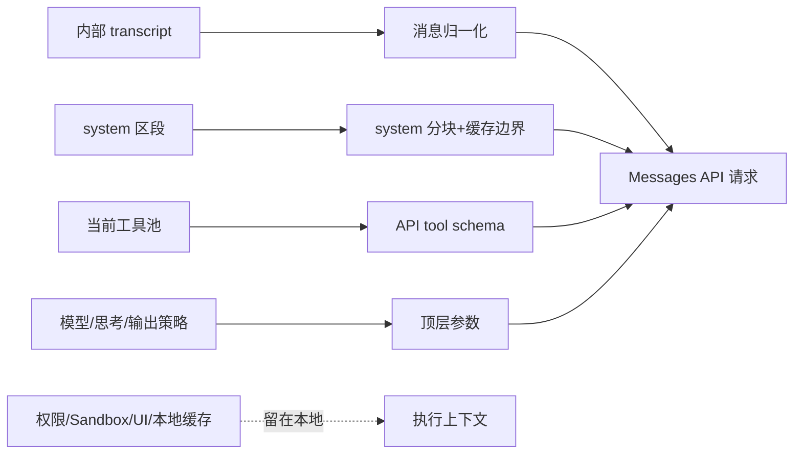

# API 请求编译

每次模型请求前，Claude Code 都要把内部丰富的运行时状态投影成 Messages API 能接受的结构。这不是字段搬运，而是一次请求编译。

## 编译的输入与输出

最终请求大致由下列部分组成：

| 顶层部分 | 承载内容 |
|---|---|
| `model` | 当前迭代真正使用的模型，可因 fallback 改变 |
| `system[]` | 已选择的基础 system、动态区段与缓存标记 |
| `messages[]` | 归一化后的用户、assistant、附件与工具回合 |
| `tools[]` | 当前真正向模型暴露的工具结构 |
| `max_tokens` / `thinking` | 输出和推理预算 |
| `metadata` | 请求级元数据 |
| 可选控制字段 | `tool_choice`、`betas`、`temperature`、`context_management`、`output_config`、`speed` |

权限规则、Sandbox 执行器、UI 状态、文件读取缓存和取消器不是 API 顶层字段，它们留在本地用于执行模型意图。

## 消息归一化是协议边界

内部消息允许 UI 进度、附件、本地系统消息、分块 assistant 响应和恢复占位。API 请求则必须符合更严格的角色和工具配对协议。

请求前会：

- 过滤仅供 UI 和运行时使用的消息；
- 把附件投影成一个或多个 meta `user` 消息；
- 合并连续 `user` 角色，以适配要求对话交替的提供方；
- 按同一 API message ID 重新合并流式 assistant 分块；
- 归一化工具别名和输入；
- 清理不完整思考块、空消息和非法媒体；
- 修复或拒绝不合法的 `tool_use` / `tool_result` 对。

这是一个有损投影：transcript 中存在的内容不一定会进入请求，但为了恢复和审计仍可留在本地历史中。

## user context 与 system context 的线上位置不同

- system context 被序列化后附加到顶层 system；
- user context 被包成 `<system-reminder>`，作为历史前部的 meta `user` 消息。

二者都是 Prompt cache key 的一部分，但不能因为名字里都有 context，就认为它们位于同一 API 字段。

## 工具数组是当前请求的快照

- ToolSearch 是否开启取决于当前模型、提供方、模式与功能开关；默认策略会延迟多数 MCP / `shouldDefer` 工具，只有 auto 模式主要使用工具规模阈值；
- 延迟工具只有在历史中被 `tool_reference` 发现后，才带完整 schema 进入当前请求；
- MCP Server 仍在连接时，ToolSearch 可以保留，以便能力稍后出现；
- 不支持工具搜索的模型会移除 ToolSearch 及相关字段。

工具的基础 schema 在会话内保持稳定，延迟加载和缓存标记作为请求级覆盖。这避免功能开关或 MCP 重连让整个工具前缀无效。

## system 分块同时服务语义和缓存

在支持的路径中：

- 稳定前缀可使用更宽的缓存作用域；
- 动态部分不进入跨组织的全局缓存；
- 实际渲染的用户级 MCP 工具会改变信任边界，system 缓存作用域因此收紧；
- 自定义 Agent Prompt 如果没有默认动态边界，不能假定也能获得相同的全局分段缓存。

缓存作用域不只是性能参数，还与内容是否包含用户专属能力相关。

## 请求 retry 保持模型不变，只重算允许变化的参数

请求编译不会在进入重试器前完全冻结。每次请求级尝试可以重新计算最大输出、思考配置、快速模式、beta 和部分输出配置，但仍使用这次模型调用已经选定的同一模型。

真正切换模型属于上层的 fallback 状态转移：主循环更新当前模型，再重新编译一次请求。这样请求级恢复可以调整传输参数，却不会与模型降级混成同一层，也不需要丢弃上层 Agent 回合状态。

## 真正的出网边界

在这份源码快照中，请求最终通过 `anthropic.beta.messages.create` 发出，主路径使用流式响应。位置是 `src/services/api/claude.ts`。

在它之前，仍然是 Claude Code 本地的请求编译；在它之后，才进入模型提供方的 Messages API。具体物理主机、认证与传输适配取决于提供方和客户端配置，不应把这个逻辑出口误解为永远直连某一固定域名。

## 请求 ID 属于消息链

并发的主 Agent、Subagent 和队友不应共享一个“最后 API request ID”全局变量。当前请求的父级跟踪信息可从当前消息链中最后一条 assistant 消息推导。

这样撤销消息会自然撤销跟踪边，并发 Agent 也不会互相覆盖 ID。这是“让关联状态附着在它所属的数据链上”的精妙例子。

## 源码定位

- 内部消息归一化：`src/utils/messages.ts`
- system 与工具 API 投影：`src/utils/api.ts`、`src/utils/toolSchemaCache.ts`
- 请求参数、缓存和最终 API：`src/services/api/claude.ts`
- 请求前上下文组装：`src/query.ts`
- 提供方与认证客户端：`src/services/api/`
