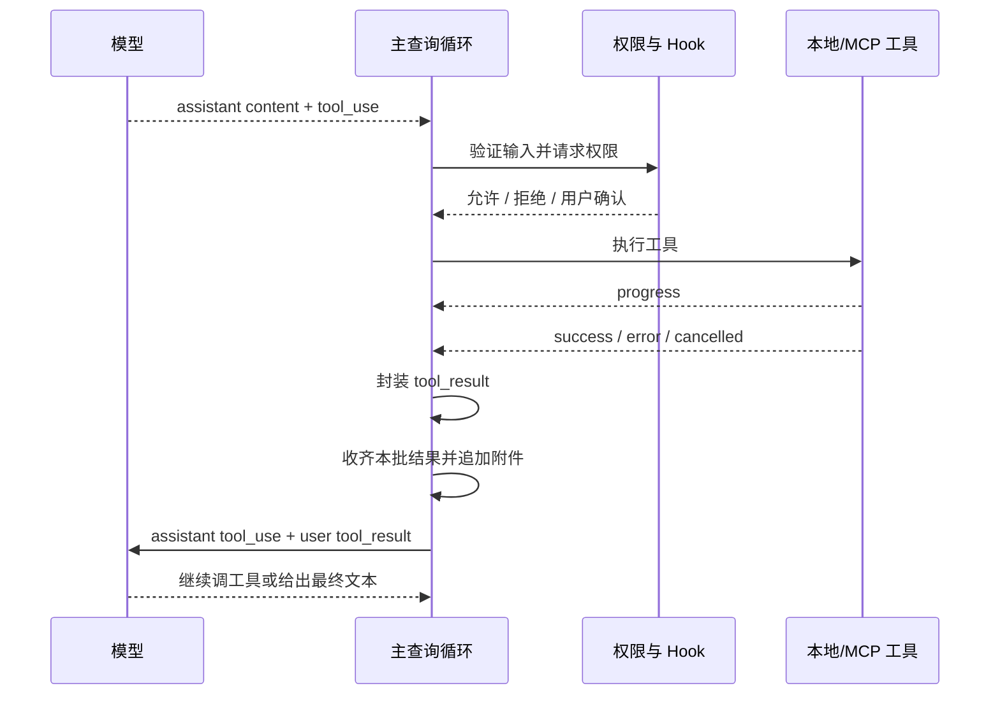

# 流式响应与工具回合

模型响应不是一个最终字符串，而是由文本、思考、工具意图、使用量和停止信号组成的流式事件序列。

工具回合的核心是：模型只产生结构化意图，Claude Code 在本地执行后，用 `tool_result` 把新世界状态送回模型。

## 流式内容块是运行时的交付粒度

流式层会逐步建立 assistant 响应：

- 消息开始时建立请求级上下文和初始使用量；
- 内容块开始时根据类型创建累加状态；
- 文本、思考、签名和工具 JSON 分别累加；
- 一个内容块结束后，就可以产生一个完整的内部 assistant 消息块；
- 消息尾部再更新最终使用量和 stop reason。

同一次 API 响应的多个内容块，在 transcript 里可以是多个内部消息，但共享同一个 API message ID。下次请求前，它们会被重新合并为一条 assistant 消息。

这个设计让 UI 可以尽早展示内容，工具也可以尽早启动，同时保证下一次 API 请求仍是合法消息形状。

## 一个工具回合的完整时序

## `tool_result` 为什么属于 user 角色

Messages API 把工具结果建模为“外部世界对 assistant 工具请求的回答”：

- assistant 消息包含 `tool_use`；
- 后续 `user` 消息包含对应的 `tool_result`；
- `tool_use_id` 把两者严格关联。

这不代表工具结果是用户手写的，而是 API 用角色表达这一次外部观测进入对话。

## 工具输入错误也必须返回 `tool_result`

工具名不存在、输入不符合 schema、权限被拒绝、执行抛出错误，以及工具被取消，都不应让协议断裂。它们通常会被封装成错误类型的 `tool_result`。

模型因此能看见失败事实，重新选择参数、改用其他工具或向用户说明。如果只抛出本地异常，下次请求会留下一个永远没有结果的 `tool_use`。

## 工具配对有三层保障

### 正常执行层

每个工具调用都会产生携带原始 ID 的结果，无论成功、失败还是权限拒绝。

### 中断与恢复补洞层

如果模型流在产生工具块后中断，或者模型 fallback 需要丢弃当前尝试，查询循环会为缺失结果的调用生成可识别的错误结果或墓石。

### API 边界修复层

发送前再做一次双向检查：

- 工具调用没有结果，插入合法的错误结果；
- 结果引用了不存在的调用，移除孤立结果；
- 重复的工具 ID 被去重；
- 会话从半个工具回合恢复时，清理开头的孤立结果并保持角色交替。

对需要严格训练轨迹的条件启用路径，可以改为发现不配对就直接失败，而不注入合成上下文。

三层保障的精妙在于：正常路径保持语义完整，异常路径保持对话可恢复，API 边界则保证不把非法协议发出。

## 进度不等于工具结果

长时间工具可以持续产生 progress，用于 UI、后台任务或 SDK 观察。但模型的下一轮决策需要的是终态 `tool_result`。

进度和结果分开，可以让本地系统实时可观测，又不会把大量短暂日志当成模型永久历史。

## 工具之后才能吸收新附件

任务通知、新用户队列输入、文件变化和新 MCP 状态可以在工具执行期间出现，但必须等本批 `tool_result` 收齐后才追加。

这样既能在同一 agentic turn 中吸收新事件，又不会把普通 user 内容插进一组工具结果之间。

## 源码定位

- 流式响应聚合：`src/services/api/claude.ts`
- 工具发现与回合：`src/query.ts`
- 工具执行：`src/services/tools/toolExecution.ts`
- 流式工具执行：`src/services/tools/StreamingToolExecutor.ts`
- 工具配对修复：`src/utils/messages.ts`
