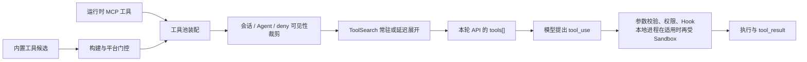

# 内置工具全景

Claude Code 的工具不是一张永远不变的菜单。源码中的工具定义只是**能力候选**；真正发送给 API 的 `tools[]`，还要经过构建版本、平台、会话形态、功能开关、权限规则、Agent 身份、MCP 连接状态和延迟加载共同裁剪。

因此，理解工具系统要同时回答三个问题：源码里是否存在、当前 Agent 是否看得见、这一次具体输入是否被允许执行。

## 一张表读懂四种“存在”

| 状态 | 含义 |
|---|---|
| 已定义 | 源码中有工具协议与本地执行能力 |
| 已注册 | 当前构建和平台把它放入候选池 |
| 已暴露 | 当前 Agent 与请求可以看到完整 schema，或可通过 ToolSearch 发现 |
| 可执行 | 本次具体参数通过权限、Hook、Sandbox 与外部系统边界 |

“源码里有”只证明第一层；不能据此推断当前模型一定能调用。

## 会话、计划与用户沟通

| 工具 | 架构职责 | 可见条件与边界 |
|---|---|---|
| `Agent`（兼容旧名 `Task`） | 把一个目标交给独立 Agent 上下文，可同步运行、后台运行、恢复，或在团队模式下创建可通信队友；也可请求 worktree 隔离 | 主线程通常可见；普通 Subagent 默认禁止继续递归委派，内部构建和特定进程内队友有窄例外；Agent 类型、后台形态与权限会再次裁剪其能力 |
| `AskUserQuestion` | 用结构化选项向用户收集决策，而不是让模型在文本里假装已经得到确认 | 依赖可交互界面；远程 channel 场景会关闭，普通 Subagent 也默认拿不到；属于可延迟工具 |
| `SendUserMessage`（兼容旧名 `Brief`） | 在 Brief／助手形态中充当用户主要可见回复通道，并可携带附件 | 不是普通 Claude Code 会话的固定输出方式；只有对应构建能力、用户资格和显式启用条件同时成立才出现。启用后不延迟，因为它是主沟通通道 |
| `Config` | 让 Agent 读取或修改受支持的 Claude Code 设置 | 当前注册表只在内部用户构建中加入；它不是任意配置文件编辑器，也不是外部发行版的通用能力 |
| `EnterPlanMode` | 请求把主会话权限状态切入 Plan Mode | 需要相应交互路径；在无法完成退出审批的 channel 场景中与退出工具一起关闭，避免进入后无法离开 |
| `ExitPlanMode` | 提交计划、请求批准并恢复执行态；队友需要计划审批时可转交团队负责人 | 对主会话通常需要用户交互；队友可走负责人审批路径。它改变权限状态，但“Plan Mode”本身不等同于内置 Plan Agent 的工具白名单 |
| `StructuredOutput` | 在要求 JSON Schema 的非交互请求中，把最终答案收束为唯一的结构化结果 | 不属于普通用户可选工具；只有非交互结构化输出条件成立时才在常规筛选之后追加，并携带该请求专属 schema |
| `Sleep` | 在主动式运行中明确等待下一次唤醒，避免用空文本回合轮询 | 只在主动式／助手相关构建与运行状态中出现；普通交互会话不需要它 |
| `Skill` | 以名字调用已发现的 Skill，把声明式工作流引入当前上下文或独立 Fork | 只接受实际已加载且允许模型调用的 Skill；它不会凭名字执行任意 slash command。Skill 的完整边界见“扩展系统”一章 |

这里最精妙的设计是：用户沟通、计划切换和结构化输出都被建模为工具协议。模型必须显式表达“提问”“交计划”“提交结构化答案”，运行时才有机会在统一的权限和状态机中处理它们。

## 文件、代码与本地检索

| 工具 | 架构职责 | 可见条件与边界 |
|---|---|---|
| `Read` | 读取文本、图片、PDF、Notebook 等工作区内容，并为后续精确编辑建立文件状态 | 读取范围仍受路径权限、工作目录和文件大小预算约束；读取不是写入授权 |
| `Edit` | 对既有文件做精确替换 | 依赖已经掌握的文件状态，并检查目标是否被外部修改；受写权限、路径与敏感文件规则约束 |
| `Write` | 创建或整体覆盖文件 | 适合新文件或明确的全文替换；同样经过写权限、路径与敏感内容边界 |
| `NotebookEdit` | 以单元格为边界修改 Jupyter Notebook | 与普通文本编辑分离，避免把 Notebook 的结构误当成纯文本；属于可延迟工具 |
| `Glob` | 按路径和文件名模式寻找候选文件 | 只回答“哪些路径匹配”，不搜索文件内容；在带嵌入式搜索能力的内部构建中可被 Shell 内的快速搜索替代，因此不一定注册 |
| `Grep` | 按正则搜索文件内容，可限定类型、目录和输出形态 | 只回答“哪些内容匹配”，不负责互联网或工具发现；与 `Glob` 一样可能被内部嵌入式搜索替代 |
| `LSP` | 通过语言服务器获取定义、引用、符号、悬停与调用层次等语义信息 | 只有环境开关允许且语言服务器已连接时才可见；它是语义索引，不是纯文本搜索的替代品 |

文件工具共享的是工作区边界，却故意拆成不同意图：发现路径、搜索内容、读取上下文、局部修改、整体写入、结构化 Notebook 修改。拆分让权限提示、审计记录和模型选择都更准确。

## Shell、网页与运行环境

| 工具 | 架构职责 | 可见条件与边界 |
|---|---|---|
| `Bash` | 执行必须通过 Shell 完成的系统命令，可在条件允许时转为后台任务 | 默认本地 Shell 能力；具体命令还要经过命令语义、规则权限和 Sandbox。后台任务关闭时，后台参数不会暴露给模型 |
| `PowerShell` | 在 Windows 上提供与 PowerShell 语义和权限规则一致的命令通道 | 仅 Windows；内部构建默认启用但可关闭，外部构建需显式启用。它不是 macOS／Linux 上 Bash 的别名 |
| `WebFetch` | 已知 URL 后抓取并提炼页面内容 | 是“取回指定页面”，不是搜索引擎；私有或需登录页面应优先使用对应 MCP。主机权限仍可要求确认；属于可延迟工具 |
| `WebSearch` | 在外部互联网中寻找当前信息 | 依赖 API 提供方与模型是否支持服务端网页搜索；第一方、受支持的 Vertex／Foundry 路径可用，其他提供方不应假定存在；属于可延迟工具 |
| `REPL` | 在内部 REPL 形态中用一个受控入口包裹 Bash、文件和检索等原语 | 只在内部用户构建且 REPL 模式启用时注册；启用后原始 `Bash`、`Read`、`Edit`、`Write`、`Glob`、`Grep`、`NotebookEdit`、`Agent` 会从模型直连工具中隐藏，避免两套入口并存 |

专用工具优先于 Shell，不只是使用体验问题。专用工具有更窄的输入协议、更清晰的权限语义和更稳定的结果结构；Shell 是无法被专用能力表达时的通用逃生口。

## 任务、后台进程与 Agent Teams

任务体系有两层，不能混为一谈：一层是 Agent 自己的工作清单，另一层是已经启动的后台执行单元。

| 工具 | 架构职责 | 可见条件与边界 |
|---|---|---|
| `TodoWrite` | 维护旧版的会话内待办清单 | 仅在新版 Task 列表未启用时出现 |
| `TaskCreate` | 在新版任务列表中创建带主题、描述、状态和依赖关系的任务 | 新版 Task 模式启用时出现；交互模式默认使用，新版能力也可在非交互模式显式开启 |
| `TaskGet` | 按任务 ID 读取完整任务 | 同上；只读 |
| `TaskList` | 查看任务列表与阻塞关系 | 同上；只读 |
| `TaskUpdate` | 更新状态、负责人、依赖与元数据，也可删除任务 | 同上；在 Agent Teams 中还承担认领任务和通知新负责人的协作语义 |
| `TaskOutput` | 读取后台 Agent 或 Shell 任务的状态和输出 | 外部构建仍保留兼容入口，但描述已标为弃用，首选直接读取任务输出文件；兼容旧名 `AgentOutputTool`、`BashOutputTool` |
| `TaskStop` | 终止正在运行的后台任务 | 兼容旧名 `KillShell`；只管理已经注册的后台任务，不是任意进程终止器 |
| `SendMessage` | 在 Agent Teams 中点对点或广播消息，并承载关机、计划审批等结构化协议 | 只有 Agent Teams 总开关成立时启用；普通消息与结构化控制消息的路由边界不同，跨会话桥接还要额外授权 |
| `TeamCreate` | 建立团队上下文、负责人身份和共享任务命名空间 | 仅 Agent Teams；创建的是协作平面，不等于立即生成所有队友 |
| `TeamDelete` | 在所有成员结束后清理团队、任务目录和关联 worktree | 仅 Agent Teams；存在活动成员时拒绝清理，防止把仍在运行的协作状态拔掉 |

`TodoWrite` 与 `TaskCreate` 等不是同一批工具的两个名字。它们是两套任务模型之间的运行时切换；而 `TaskOutput`／`TaskStop` 管的是后台执行生命周期。

## Worktree 与调度工具

| 工具 | 架构职责 | 可见条件与边界 |
|---|---|---|
| `EnterWorktree` | 创建隔离的 Git worktree，并把当前会话的有效工作目录切过去 | 当前快照中 worktree 能力全局开启；真正进入仍要求可创建 worktree 的仓库或配置 Hook |
| `ExitWorktree` | 返回原工作目录，并选择保留或清理 worktree | 清理前检查未提交与未合并状态；需要显式确认危险清理，不是简单的目录切换 |
| `CronCreate` | 为当前 Agent 安排一次性或周期性 Prompt；可选择仅会话内或持久化 | 只有 Agent Trigger 构建能力和运行时 Cron 开关都成立才出现；队友创建的任务会回到对应队友 |
| `CronList` | 列出当前可见的定时任务 | 同上；只读 |
| `CronDelete` | 删除指定定时任务 | 同上；只删除当前调度命名空间里的任务 |
| `RemoteTrigger` | 管理并运行远端 Agent Trigger | 需要远端 Trigger 构建能力、运行时开关和远程会话策略同时允许；它管理远端调度，不等于本地 `Cron*` |

Worktree 是文件系统隔离层，Cron／RemoteTrigger 是时间与唤醒层。它们都改变 Agent 的运行环境，但不会替代权限系统。

## MCP 工具与资源工具

| 工具 | 架构职责 | 可见条件与边界 |
|---|---|---|
| 动态 `mcp__服务__工具` | 把 MCP Server 的工具声明适配成 Claude 工具协议 | Server 连接并返回工具后动态产生；通常加完全限定前缀，SDK 的显式 no-prefix 模式是例外。`alwaysLoad` 元数据可阻止延迟加载 |
| `mcp__服务__authenticate` | 在需要认证而真实工具尚不可用时，向模型暴露 OAuth 启动能力 | 只对处于需认证状态且传输类型支持相应流程的 Server 生成；认证完成后真实工具会替换它 |
| `ListMcpResourcesTool` | 枚举已连接 MCP Server 提供的资源 URI 和元信息 | 只有至少一个已连接 Server 声明 resources 能力时追加；全局只需一组帮助工具 |
| `ReadMcpResourceTool` | 按 Server 和 URI 读取一个 MCP 资源 | 与资源列表工具成对出现；资源是数据对象，不是可执行工具 |
| 内部 `MCPTool` 适配模板 | 为动态 MCP 工具提供统一权限、进度、结果和 UI 契约 | 它本身的占位名不会作为普通业务工具发送；每个 Server 工具会覆盖名称、schema 与描述后进入工具池 |

MCP 的关键边界是：Server 决定“提供什么能力”，Claude Code 决定“如何命名、何时暴露、怎样授权、如何接回 tool result”。MCP 不能绕过本地 deny 与 Hook；本地 Sandbox 只约束适用的本地执行路径，远端 Server 的副作用还要依赖 MCP 权限和外部系统自身授权。Server 提供的只读／破坏性注解也只是决策信号，不是最终授权。

## ToolSearch：工具目录的搜索入口

`ToolSearch` 不搜索文件、代码或互联网。它搜索的是**当前已知但尚未展开 schema 的工具**。

默认策略会把多数 MCP 工具以及标记为可延迟的内置工具保留为名称，把 `ToolSearch` 本身常驻。模型选中匹配项后，结果中的工具引用使完整 schema 进入后续请求。具体启用还受模型能力、提供方、禁用开关、`ToolSearch` 自身可见性与模式影响；只有自动模式才主要按工具定义占上下文的比例决定是否延迟。

下一章会单独展开它与 `Glob`、`Grep`、`WebSearch`、MCP resources 的区别。

## 仅在条件构建中出现的注册项

当前 `src/tools.ts` 还引用一组按内部用户、环境变量或构建 Feature 裁剪的工具：`Tungsten`、`SuggestBackgroundPR`、`WebBrowser`、`OverflowTest`、`CtxInspect`、`TerminalCapture`、`VerifyPlanExecution`、`Workflow`、`Monitor`、`SendUserFile`、`PushNotification`、`SubscribePR`、`Snip`、`ListPeers`。

这些模块没有全部包含在当前源码快照中。能从现有源码确认的是它们的**注册条件和在工具池中的位置**，不能可靠还原的执行语义不在本教程中推测。`TestingPermission` 则明确只服务测试环境，用来验证“总是要求权限”的端到端流程，不属于生产能力。

这组条件注册项说明：Claude Code 会在构建期就裁掉不属于某发行形态的能力，而不只是运行时把它们隐藏起来。

## 三种会让工具池整体变形的模式

### 简化模式

简化模式把能力缩到 `Bash`、`Read`、`Edit`；若 REPL 模式同时启用，则只保留 REPL 包装入口。协调者模式可额外保留必要的委派和停止能力。

### 协调者模式

协调者只保留 `Agent`、`TaskStop`、`SendMessage`、`StructuredOutput` 等编排能力，把实际读写和命令执行交给 Worker。这不是“协调者自觉不写文件”，而是请求中的能力图已经移除了执行工具。

### Agent 与后台模式

Subagent 会按自己的权限模式从会话候选重新装配基础池，再按定义、同步／后台身份和团队身份裁剪；只有 Fork 精确复制父工具快照。基础池 MCP 与 Agent 专属 MCP 还有不同装配路径，详见“工具能力图”和“Subagent 构造”。

## 设计结论

Claude Code 没有把所有动作塞进一个万能终端工具，而是把工具系统分成四层：

1. 小而稳定的内置协议；
2. 按构建、平台与会话形态裁剪的候选池；
3. 由 MCP、Plugin、Agent 与结构化输出动态追加的能力；
4. 在每次调用时生效的权限、Hook 与 Sandbox。

这样既能让模型获得开放扩展能力，又不会把“模型看得见工具”错误地等同于“模型拥有执行权”。

## 源码定位

- 工具注册表与条件门控：`src/tools.ts`
- 工具公共协议：`src/Tool.ts`
- 工具池合并、排序与协调者裁剪：`src/hooks/useMergedTools.ts`、`src/utils/toolPool.ts`
- Agent 工具裁剪：`src/tools/AgentTool/agentToolUtils.ts`、`src/constants/tools.ts`
- 各内置工具：`src/tools/`
- Shell 与平台门控：`src/utils/shell/shellToolUtils.ts`
- MCP 动态工具、认证与资源：`src/services/mcp/client.ts`、`src/tools/MCPTool/`、`src/tools/McpAuthTool/`、`src/tools/ListMcpResourcesTool/`、`src/tools/ReadMcpResourceTool/`
- 结构化输出工具：`src/tools/SyntheticOutputTool/SyntheticOutputTool.ts`、`src/main.tsx`
- ToolSearch：`src/tools/ToolSearchTool/`、`src/utils/toolSearch.ts`
