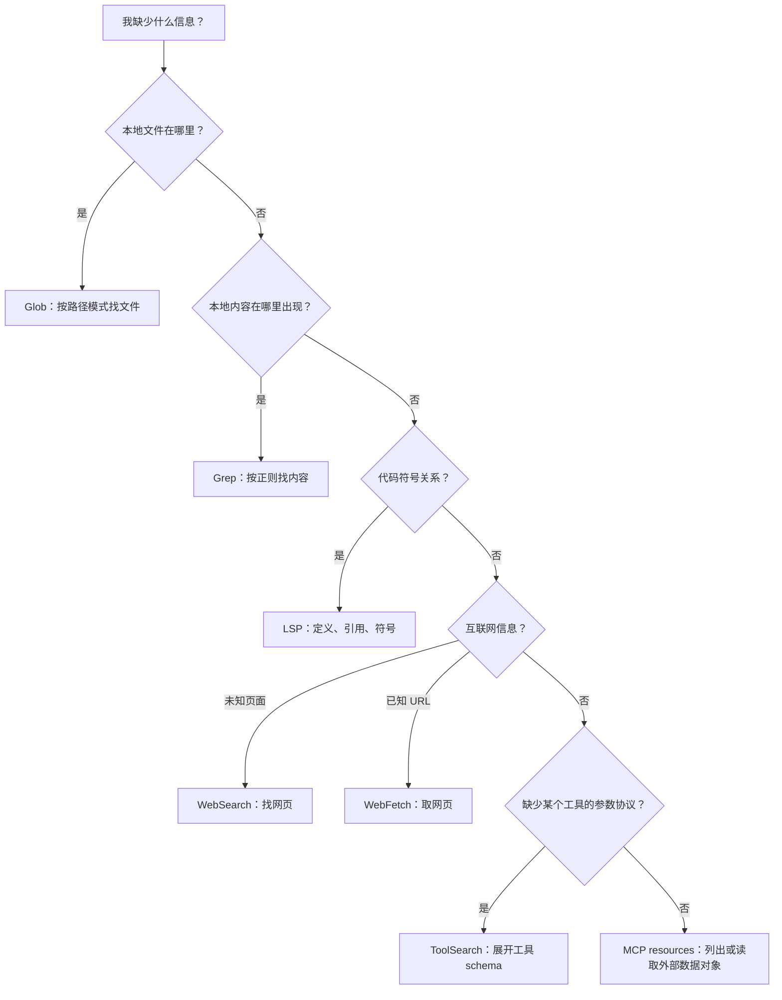
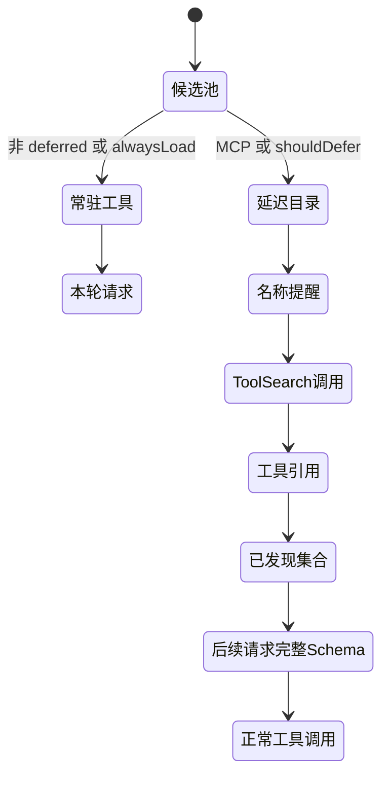

# 搜索体系与 ToolSearch

Claude Code 里有多个名字带“搜索”的能力，但它们搜索的对象完全不同。最常见的误解，是把 `ToolSearch` 当成代码搜索，或把 `WebFetch` 当成搜索引擎。

先记住一句话：**路径用 Glob，内容用 Grep，语义用 LSP，未知网页用 WebSearch，已知网页用 WebFetch，工具 schema 用 ToolSearch，MCP 数据对象用 resources。**

## 七种能力的边界

| 能力 | 搜索空间 | 输入线索 | 返回的是什么 | 不负责什么 |
|---|---|---|---|---|
| `Glob` | 本地目录树 | 路径通配模式、起始目录 | 匹配的文件路径 | 不读取文件内容，不理解符号语义 |
| `Grep` | 本地文件内容 | 正则、文件类型、目录、输出模式 | 匹配行、文件名或计数 | 不发现工具，不访问互联网 |
| `LSP` | 已连接语言服务器的代码索引 | 文件位置、符号或查询类型 | 定义、引用、符号、悬停、调用层次 | 不保证覆盖未被语言服务器索引的文本 |
| `WebSearch` | 外部互联网搜索服务 | 自然语言查询、域名过滤 | 搜索结果与引用内容 | 不保证访问登录后页面，不读取本地文件 |
| `WebFetch` | 一个已知 URL | URL 与提炼目标 | 页面内容的提取结果 | 不替用户发现 URL；不适合认证站点 |
| `ToolSearch` | 当前会话的 deferred tool 目录 | 精确工具名或能力关键词 | 工具引用，使完整 schema 可用 | 不执行命中的工具，不搜索业务数据 |
| MCP resources | 已连接 MCP Server 的资源目录 | Server 名、资源 URI | 资源元信息或资源内容 | 不等同 MCP tool，也不搜索 Claude 的工具 schema |

这张表体现了 Claude Code 的一个核心取舍：不使用一个“大搜索工具”包办所有事情，而是让每种索引都保留自己的权限、结果形态和失败语义。

## Glob：先缩小路径空间

`Glob` 的问题是“哪些文件名或路径符合模式”。它适合在不知道精确文件位置时建立候选集，例如找所有某类配置、测试或组件文件。

它返回的是路径，不是文件内容。找到路径后，通常还要交给 `Read`、`Grep` 或 `LSP`。在包含嵌入式快速搜索的内部构建中，专用 `Glob` 可不注册；这是能力入口变化，不是路径搜索需求消失。

## Grep：在候选内容中找证据

`Grep` 的问题是“这段文本或正则在哪些文件里出现”。它可以控制搜索目录、文件类型、上下文行、计数和只返回文件名等输出形态。

它最适合回答调用点、配置键、错误信息和文本引用等问题。`Grep` 不知道某个标识符是否真是语言符号；需要定义、引用或调用层次时，LSP 的语义索引更准确。

## WebSearch 与 WebFetch：发现和读取分离

`WebSearch` 负责从未知信息空间中发现页面，能力是否存在取决于 API 提供方与模型。`WebFetch` 负责读取已经知道的 URL，并根据 Prompt 提炼内容。

两者分离有两个好处：

- 搜索结果可以保留“为什么选中这个来源”的发现语义；
- 对指定主机的访问许可可以落在 `WebFetch` 的 URL 边界上。

遇到 GitHub、文档系统或企业服务的私有页面，架构上应转向有认证能力的 MCP，而不是让 `WebFetch` 反复失败。

## MCP resources：外部系统的数据目录

MCP Server 可以同时提供 tools、prompts／skills 和 resources。resources 是可列举、可按 URI 读取的数据对象，例如文档、记录或二进制内容。

当至少一个已连接 Server 声明 resources 能力时，Claude Code 才追加一组全局 `ListMcpResourcesTool` 与 `ReadMcpResourceTool`。前者发现 URI，后者读取指定 URI；它们不是每个 Server 各复制一套。

资源目录回答“外部系统里有什么数据”，ToolSearch 回答“Claude 当前还能调用什么工具”。两者看起来都有“列出再选择”，但索引对象完全不同。

## ToolSearch 解决的是 Prompt 体积问题

每个工具在 API 请求中都需要名称、描述和输入 JSON Schema。连接大量 MCP Server 后，即使本轮一个都不用，完整工具定义也会长期占据上下文，并让工具列表变化更容易破坏 Prompt cache。

ToolSearch 把工具能力拆成两级：

1. 初始请求只让模型知道 deferred 工具的名称；
2. 模型真正需要时，再取回少数完整 schema。

## 哪些工具会被延迟

延迟分类先尊重 `alwaysLoad`：一个 MCP 工具若声明必须常驻，就不会进入 deferred 集合。

除此之外：

- MCP 工具默认可延迟；
- 内置工具只有显式标记 `shouldDefer` 才可延迟；
- `ToolSearch` 自己永远常驻，否则模型没有入口取回其他 schema；
- 作为当前主要交互通道的 `SendUserMessage` 不延迟；
- 条件启用的 Fork-first `Agent` 也可被强制常驻，保证首轮即可委派。

所以，“MCP 一定延迟”也不准确：`alwaysLoad` 是明确例外。

## ToolSearch 何时真正启用

源码把“候选时可能启用”和“发请求时最终启用”分开。

最终决策至少检查：

- 当前模式是始终启用、自动阈值，还是标准全量工具模式；
- 模型是否支持 `tool_reference`；
- `ToolSearch` 是否仍在当前 Agent 的工具池中；
- 实验性 beta 是否被总开关关闭；
- 第一方代理地址是否明确支持相应协议，或用户是否显式声明支持；
- 自动模式下，deferred 工具的名称、描述和 schema 是否超过上下文窗口的一定比例。

默认模式倾向于始终延迟 MCP 与 `shouldDefer` 工具；只有自动模式主要依据体积阈值。不能把 ToolSearch 简化成“工具超过某个数量才开启”。

## 一次 ToolSearch 如何改变后续请求

`ToolSearch` 支持两种查询意图：

- 精确选择：直接指定一个或多个工具名；
- 关键词检索：根据工具名拆词、描述和搜索提示排序，并可要求某些关键词必须命中。

返回值不是业务数据，而是 `tool_reference`。API 用这个引用展开对应工具的完整定义；本地历史也会扫描这些引用，重建“已经发现的工具集合”。

这意味着工具发现状态不是隐藏的全局变量，而是尽量落在可重放的消息历史里。完整压缩会把压缩前已发现集合带到压缩边界，避免长会话压缩后突然忘记已经加载过的工具。

## 工具目录变化有两条条件路径

MCP Server 可以在会话中连接、断开或通知工具列表变化。如果每次都回头改写旧 Prompt，缓存前缀会频繁失效。

在内部构建或相应功能开关开启时，运行时会计算 deferred 工具目录的新增与移除，并以持久的尾部提醒表达变化。旧历史保持不动，新请求只看到增量；工具定义缓存也按工具身份复用。

该条件路径未开启时，不会写入这种目录增量附件，而是在每次请求前临时前置当前全部可用 deferred 工具名称。它仍能让模型发现能力，但不应被描述成“目录变化一定被持久化为增量”。

增量路径与动态 Agent 列表、Skill 发现、Memory 附件使用同一原则：**动态事实尽量追加，不重写已经缓存的前缀。**全量临时路径则用更简单的请求时快照换取相同行为可见性。

## ToolSearch 不会扩大权限

取回 schema 只把工具从“知道名字”变成“知道怎样提出调用”。它不会：

- 把被 Agent 白名单移除的工具重新加回来；
- 绕过全局 deny；
- 自动批准某个具体输入；
- 绕过 PreToolUse Hook 或 Sandbox；
- 让断开的 MCP Server 恢复连接。

因此工具有三个不同状态：不可见、可发现但未展开、已展开但调用仍需授权。ToolSearch 只负责第二个状态到第三个状态的转换。

## 设计结论

Claude Code 的搜索体系不是按“命令叫什么”分类，而是按**索引对象**分类：文件树、文本、语言语义、互联网、已知页面、工具协议和外部资源。

ToolSearch 最值得借鉴的地方，是把开放工具生态的上下文成本从“连接多少就永久支付多少”改成“本轮需要多少才展开多少”，同时用消息历史保持发现状态可恢复。

## 源码定位

- 路径搜索：`src/tools/GlobTool/`
- 内容搜索：`src/tools/GrepTool/`
- 语义搜索：`src/tools/LSPTool/`
- 网页发现与读取：`src/tools/WebSearchTool/`、`src/tools/WebFetchTool/`
- ToolSearch 协议与排序：`src/tools/ToolSearchTool/`
- ToolSearch 模式、阈值、已发现集合与目录增量：`src/utils/toolSearch.ts`
- MCP 资源发现与读取：`src/tools/ListMcpResourcesTool/`、`src/tools/ReadMcpResourceTool/`
- MCP tools／resources 动态装配：`src/services/mcp/client.ts`
- deferred 工具提醒：`src/utils/attachments.ts`、`src/utils/messages.ts`
- API 工具投影与 schema 缓存：`src/utils/api.ts`、`src/utils/toolSchemaCache.ts`
