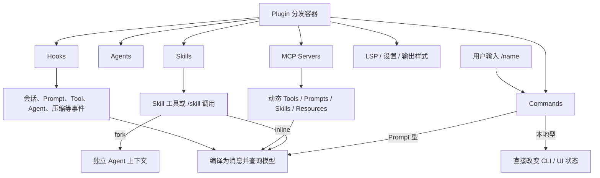
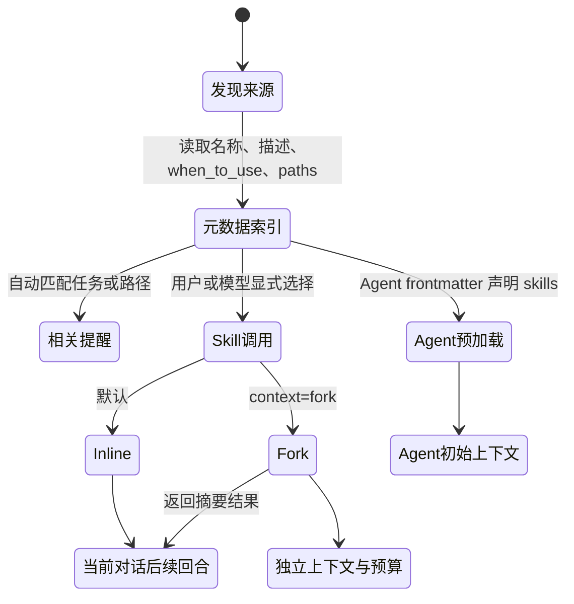
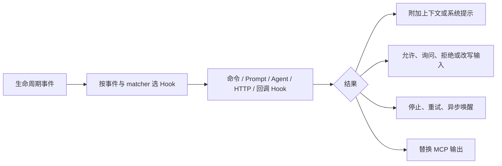
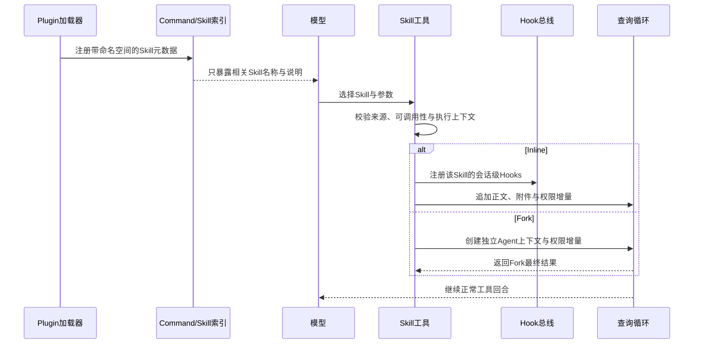

# 扩展系统

Claude Code 的扩展能力由六个不同概念组成：Command、Skill、Tool、Plugin、MCP 和 Hook。它们可以被同一个 Plugin 打包，也可能在一次任务中互相调用，但职责并不重叠。

最容易记的边界是：**Command 是用户入口，Skill 是可加载的方法说明，Tool 是模型动作协议，Plugin 是分发容器，MCP 是外部能力协议，Hook 是生命周期拦截器。**

## 六个概念的职责边界

| 模块 | 谁触发 | 核心产物 | 是否直接成为 API tool | 典型用途 |
|---|---|---|---|---|
| Command | 用户输入 slash command，或 CLI 自身 | 本地操作结果、UI，或一组要交给模型的消息 | 否 | 配置、登录、会话管理、把预制 Prompt 送入对话 |
| Skill | 用户通过 `/skill`，或模型通过 `Skill` 工具 | 一段带元数据、资源和约束的任务方法 | Skill 本身不直接成为独立 tool；统一经 `Skill` 工具调用 | 复用领域知识和多步工作流 |
| Tool | 模型生成 `tool_use` | 一个有名称、描述和输入 schema 的动作协议 | 是 | 文件、Shell、网页、Agent、MCP 等可执行动作 |
| Plugin | 用户／组织安装并启用 | 一组 Commands、Skills、Agents、Hooks、MCP、LSP、设置等组件 | Plugin 本身不是 tool | 分发、版本、依赖和策略管理 |
| MCP | 连接外部进程或服务 | 动态 Tools、Prompts／Skills、Resources | 其 tools 会动态成为 API tools | 接入外部系统和认证数据 |
| Hook | 生命周期事件自动触发 | 允许／拒绝、改写输入、附加上下文、停止、重试或通知 | 否 | 安全策略、自动化、审计与上下文注入 |

这套分层避免了一个常见架构错误：把“扩展包”“模型能力”“用户命令”“生命周期回调”都叫作插件，然后让权限和执行顺序变得不可解释。

## Command：CLI 的入口层

Command 首先是 Claude Code 的控制平面。它有三种形态：

- 本地 Command：直接完成无模型参与的本地操作；
- 本地 UI Command：打开交互界面并回传结果；
- Prompt Command：把预制内容、参数和附件编译成消息，再进入查询循环。

因此 `/config`、`/mcp` 一类控制命令与 Skill 看起来都使用 slash 入口，但架构语义不同。模型只能通过 `Skill` 调用允许模型调用的 Prompt 型能力，不能猜测并执行任意内置 Command。

Command 还有独立的可用性边界：认证提供方、交互／非交互模式、功能开关、远程模式和是否对用户隐藏。它们决定“用户能否看到和运行这个入口”，不等同工具执行权限。

## Skill：声明式能力包

Skill 本质上是带 frontmatter 的 Markdown 能力包。正文描述如何完成任务，frontmatter 描述何时可见、谁能调用、用什么模型、允许哪些工具、是否 Fork、绑定哪些 Hook，以及适用哪些路径。

Claude Code 不在启动时把所有 Skill 正文塞进 Prompt。发现阶段只把名称、描述和适用条件等轻量元数据暴露给模型；只有被调用或被 Agent 预加载时，正文才进入 Agent 上下文。这样 Skill 数量不会直接变成常驻 Prompt 成本。

## Skill 从哪里被发现

当前源码把多个来源汇入统一 Command／Skill 索引：

- 组织托管的 Skills；
- 用户级 Skills；
- 项目及从工作目录向上的 `.claude/skills`；
- `--add-dir` 指定目录；
- 兼容旧版 `.claude/commands`；
- Bundled Skills；
- 已启用 Plugin 提供的 Skills；
- 条件启用的 MCP Skills；
- 会话中因访问嵌套目录而动态发现的 Skills。

同一个实体可能经符号链接或多条目录路径被发现，加载器按真实路径去重。裸模式会跳过大部分自动目录遍历，只保留显式来源与单独注册的 Bundled 能力；组织策略还可以把 Skills 限制为仅 Plugin 来源。

### 路径条件与嵌套发现

Skill 可以声明 `paths`。这类 Skill 启动时只进入候选集合；当 `Read`、`Edit` 或 `Write` 触及匹配文件后才激活。

文件操作还会从目标文件目录向当前工作目录回溯，发现更深层的 `.claude/skills`。越靠近目标文件的 Skill 具有更具体的作用域。新发现结果通过尾部提醒进入后续回合，而不是回写旧 Prompt。

### 用户可调用与模型可调用是两条开关

`user-invocable` 决定用户能否用 slash 入口看到并调用；`disable-model-invocation` 决定模型能否通过 `Skill` 工具选择它。

因此可以存在：只给用户的 Skill、只给模型的 Skill、两者都可调用的 Skill。隐藏 UI 不等于禁止模型调用，反之亦然。

## Skill 的三种进入 Agent 的方式

| 方式 | 上下文归属 | 正文如何进入 | `allowed-tools` | Skill frontmatter Hooks |
|---|---|---|---|---|
| Inline 调用 | 当前 Agent | 作为元用户消息加入当前对话 | 追加为当前调用后的权限允许规则 | 在当前会话作用域注册 |
| Fork 调用 | 新的子 Agent | 作为 Fork 的起始任务 | 追加到 Fork 的权限上下文 | 当前快照的 Fork 分支不经过 Inline 的 Skill Hook 注册路径 |
| Agent 预加载 | 新 Agent 的初始上下文 | Agent 定义的 `skills` 列表并行加载正文 | 不自动应用 | 不自动注册 |

这个差异非常关键。**预加载 Skill 等于给 Agent 教材，不等于执行一次 Skill。**它不会自动获得 Skill 声明的权限，也不会因为正文被放入初始上下文就安装 Skill Hook。

Fork Skill 也不是“大号 Inline”：它选择一个 Agent 定义，在独立上下文和 Token 预算中运行，只把最终结果带回调用方。它适合输出噪音大、步骤多、需要隔离上下文的流程。

## `allowed-tools` 是权限增量，不是能力安装

Skill 的 `allowed-tools` 会把声明的规则加入该次 Inline 或 Fork 的允许上下文。它解决的是“这个已知工作流被允许使用哪些现有工具”，而不是：

- 向工具池安装一个不存在的工具；
- 让被 Agent 白名单移除的工具重新可见；
- 覆盖更高优先级的 deny；
- 绕过 Sandbox、路径边界或外部服务授权。

这让 Skill 可以携带完成工作所需的最小权限提示，同时仍服从系统的硬边界。

## Skill Hooks 是有生命周期的临时扩展

Inline Skill 被实际调用时，它的 Hooks 注册到当前会话作用域，并与 Skill 根目录绑定。Hook 策略可以限制非受信来源注册 Hook；压缩时，已调用 Skill 的必要内容会按 Agent 作用域恢复，防止不同 Agent 的 Skill 状态互相泄漏。

Hooks 不属于 Skill 正文。正文影响模型决策，Hook 在确定事件点影响运行时决策；两者必须分别审计。

## Plugin：组件的分发与治理容器

Plugin 的职责不是“运行”，而是把多个组件作为一个可安装、可启用、可升级和可治理的单元交付。

一个 Plugin 可以声明：

- Commands 与 Skills；
- Agent 定义；
- Hooks；
- MCP Servers 与 channel；
- LSP Servers；
- 输出样式；
- 默认设置和用户可配置项。

加载过程先解析 manifest 与约定目录，再合并 marketplace 元数据、启用状态和组织策略。缺少依赖的 Plugin 会从 enabled 集合降级；组织可以强制禁用 Plugin，跨 marketplace 自动依赖还有单独信任边界。

Plugin 组件会带来源命名空间，MCP Server 也会增加 Plugin scope，避免两个 Plugin 的同名 Skill、Command 或 Server 静默覆盖。热重载通过缓存失效重新装配组件，而不是让旧 Hook、旧 MCP 和新命令各自漂移。

## MCP：独立于 Plugin 的运行时协议

Plugin 可以携带 MCP 配置，但 MCP 不依赖 Plugin 才能存在。用户、项目、SDK、Plugin 或动态 Agent 都可以提供 MCP Server 配置。

连接成功后，一个 Server 可以贡献：

- 动态工具；
- Prompt Commands；
- 条件启用的 MCP Skills；
- Resources；
- Server instructions 与通知。

需要认证时，真实工具尚不可见，运行时可先暴露该 Server 的认证工具。工具列表变化后会刷新工具池，并通过 ToolSearch 增量提醒模型。

所以 Plugin 解决“如何分发一组能力”，MCP 解决“如何在运行时与外部能力服务协商”。

## Hook：不经过模型选择的拦截平面

Hook 在事件发生时自动运行，来源可以是设置、Plugin、Skill、Agent frontmatter 或 SDK 回调。它不是 Tool，模型不能通过编造一个 Hook 名称来调用它。

Hook 覆盖的事件包括会话开始与结束、用户 Prompt 提交、工具调用前后与失败、权限请求和拒绝、Subagent 开始与结束、压缩前后、通知、MCP elicitation、任务与队友状态、工作目录和文件变化等。

### Hook 能做什么

- `PreToolUse` 可以建议允许、询问或拒绝，附加上下文，也可改写工具输入；
- `PermissionRequest` 可以对真正的权限询问给出结构化决定；
- `PostToolUse` 可以附加结果上下文，对 MCP 结果还可以给出替换值；
- 失败、停止、压缩、Subagent 等事件可以阻止继续或补充后续消息；
- 异步 Hook 可以在后台完成并选择是否重新唤醒会话。

Hook 的“允许”不是超级权限。工具仍要经过设置中的 deny／ask 规则；Hook 也不能绕过 Sandbox。这个优先级防止低信任扩展通过一个 PreToolUse 回调推翻管理员策略。

### Hook 的作用域与信任

设置级 Hook、Plugin Hook、Skill Hook 和 Agent Hook 会在统一事件总线上合并，但保留来源根目录和会话／Agent 作用域。相同命令只在相同来源上下文内去重，避免两个 Plugin 使用相同模板时互相吞掉。

Plugin-only 或 managed-only 策略会在注册点阻止不受信的 Skill／Agent Hooks，而不是事后笼统禁掉所有运行时 Hook。这样管理员提供的 Plugin Hook 与 SDK 内部 Hook仍能正常工作。

## 一次 Plugin Skill 调用穿过哪些边界

这条链路说明，Skill 不是直接执行 Markdown。它先经过来源发现和调用资格，再选择上下文形态，最后才影响查询循环；Plugin、Hook 和权限各有自己的边界。

## 设计结论

Claude Code 扩展架构最值得借鉴的不是“支持很多插件”，而是把扩展拆成六个互相正交的维度：

- 入口与 UI 属于 Command；
- 方法与上下文属于 Skill；
- 动作协议属于 Tool；
- 分发与治理属于 Plugin；
- 外部能力协商属于 MCP；
- 生命周期控制属于 Hook。

当这些维度分开后，系统才能分别回答：谁安装、谁看见、谁触发、在哪个上下文运行、获得什么权限、何时被拦截。

## 源码定位

- Command 类型、可用性与统一装配：`src/types/command.ts`、`src/commands.ts`
- slash command 到消息：`src/utils/processUserInput/processSlashCommand.tsx`
- Skill 来源、frontmatter、路径条件与动态发现：`src/skills/loadSkillsDir.ts`
- Skill 调用、Inline 与 Fork：`src/tools/SkillTool/SkillTool.ts`、`src/utils/forkedAgent.ts`
- Agent Skill 预加载：`src/tools/AgentTool/loadAgentsDir.ts`、`src/tools/AgentTool/runAgent.ts`
- Plugin manifest 与组件模型：`src/types/plugin.ts`、`src/utils/plugins/schemas.ts`
- Plugin 加载、策略与依赖：`src/utils/plugins/pluginLoader.ts`、`src/utils/plugins/pluginPolicy.ts`、`src/utils/plugins/dependencyResolver.ts`
- Plugin Commands／Skills／Hooks／MCP：`src/utils/plugins/loadPluginCommands.ts`、`src/utils/plugins/loadPluginHooks.ts`、`src/utils/plugins/mcpPluginIntegration.ts`
- MCP 连接与能力适配：`src/services/mcp/client.ts`、`src/services/mcp/config.ts`
- Hook 协议与事件编排：`src/schemas/hooks.ts`、`src/types/hooks.ts`、`src/utils/hooks.ts`、`src/services/tools/toolHooks.ts`
