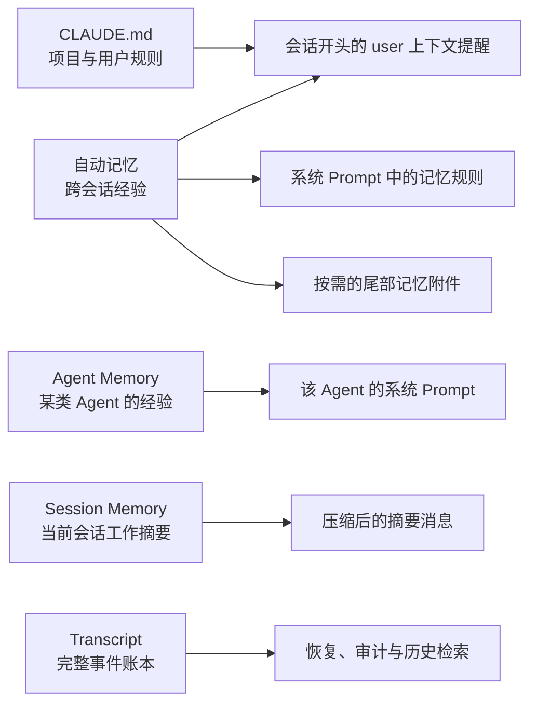

# Memory 体系：五种持久化不能混为一谈

Claude Code 并没有一个笼统的“记忆模块”。它把长期规则、跨会话经验、角色专属经验、当前会话摘要和完整审计记录拆成五条通道。它们都落盘，但作用域、进入模型的位置和保留目的完全不同。

## 先看清五条边界

| 机制 | 解决的问题 | 作用域 | 进入模型的位置 | 持久化边界 |
|---|---|---|---|---|
| CLAUDE.md 体系 | Claude 在这个环境里必须怎样工作 | 管理级、用户级、项目级、本地项目级 | 会话开头的 `user` 角色元提醒；进入 `claudeMd` 用户上下文 | 独立文件；项目文件可随仓库共享，本地文件只留在本机 |
| 自动记忆 | 从过去会话保留用户偏好、反馈和非代码事实 | 默认按规范化项目根目录；同一仓库的 worktree 共用 | 记忆行为规则在系统 Prompt；索引通常随初始用户上下文，条件启用时相关正文作为尾部附件 | 跨会话目录，直到被更新或删除 |
| Agent Memory | 让某一种 Agent 延续自己的专门经验 | Agent 类型 × `user`、`project` 或 `local` 范围 | 直接附加到该 Agent 的系统 Prompt | 跨该 Agent 的多次运行；不同 Agent 类型彼此分开 |
| Session Memory | 让一条很长的当前会话在压缩后仍可继续 | 当前项目目录 × 当前 `sessionId` | 平时不逐轮注入；主要在压缩时成为摘要消息 | 随该会话保存，可服务同一会话恢复，不作为未来会话的通用经验 |
| Transcript | 保存实际发生过什么 | 主会话一份，Subagent 各有侧链文件 | 不默认整体发送给模型；恢复时重建消息链，必要时检索 | JSONL 会话账本，受会话持久化与清理周期控制 |

## CLAUDE.md 是规则层，不是经验数据库

源码把 CLAUDE.md 家族分为四级：

1. 管理级规则：组织或设备统一下发；
2. 用户级规则：对该用户的所有项目生效；
3. 项目级规则：项目根路径上的 `CLAUDE.md`、`.claude/CLAUDE.md` 与 `.claude/rules/*.md`；
4. 本地项目规则：`CLAUDE.local.md`，只属于当前用户和当前项目。

发现过程从当前工作目录向上遍历，越靠近当前目录的内容越晚装入、注意力优先级越高。规则还可以通过 `@` 引入其他文本文件；带路径条件的规则只在访问匹配文件时按需补入，而不是把整棵目录的规则一次性塞进上下文。

它的注入位置很容易被误解：CLAUDE.md 内容不是默认系统 Prompt 的一个静态段。运行时先把它编译进用户上下文，再变成会话最前部的 `user` 角色元消息，并包在 `<system-reminder>` 中。这样它在语义上仍是高优先级环境规则，同时保持系统 Prompt 的缓存边界稳定。

## 自动记忆是跨会话经验层

自动记忆默认位于配置目录下按项目根路径隔离的 `memory/` 目录。项目身份优先使用规范化 Git 根目录，因此同一仓库的多个 worktree 不会形成互不相识的记忆孤岛。

目录采用“索引 + 主题文件”结构：

- `MEMORY.md` 只保存简短索引，受行数和字节上限约束；
- 具体内容放在独立主题文件中；
- 记忆按语义主题组织，不按聊天时间顺序堆积；
- 当前源码把可保存内容约束为用户信息、反馈、项目上下文和外部参考；能从代码或 Git 直接得到的事实不应重复保存。

自动记忆有两条不同的注入路径：

- “怎样保存、何时读取、过期内容必须复核”等行为规则，放入默认系统 Prompt 的动态记忆段；
- `MEMORY.md` 的实际索引通常跟随 CLAUDE.md 一起进入初始用户上下文。条件功能启用时，索引不再常驻，而是先根据当前问题从主题文件中挑选少量相关记忆，再以 `relevant_memories` 附件追加到对话尾部。

这意味着自动记忆不是把整个历史知识库永久塞进 Prompt，而是“一个小索引 + 按需召回”。主 Agent 可以直接写记忆；条件启用时，完整回合结束后还会有一个受限 Fork 从新增对话中提取遗漏内容。这个 Fork 复用主会话缓存，但写权限只开放给自动记忆目录，且若主 Agent 已经写过记忆，本轮不会重复提取。

## Agent Memory 是角色专属的长期经验

Agent 定义只有显式声明 `memory` 才拥有 Agent Memory。目录以 Agent 类型命名，所以同一项目里的“代码审查 Agent”和“测试 Agent”不会共享一锅经验。

它有三种范围：

- `user`：跨项目复用，适合该 Agent 的通用经验；
- `project`：位于项目的 `.claude/agent-memory/`，可随版本控制共享；
- `local`：位于 `.claude/agent-memory-local/`，只属于当前项目与本机。

它与自动记忆最大的架构差异是注入位置。Agent Memory 的规则和 `MEMORY.md` 内容在 Agent 构造时一起附加到该 Agent 的系统 Prompt，而不是进入主会话的用户上下文。启用它的 Agent 还会得到必要的读写工具能力，以维护自己的记忆目录。

因此 Agent Memory 绑定的是“角色”，自动记忆绑定的是“用户与项目”。主 Agent 知道某条用户偏好，不代表每种专用 Agent 都应把它写进自己的角色经验；反过来也一样。

## Session Memory 是当前会话的滚动工作摘要

Session Memory 保存到当前项目会话目录下的 `session-memory/summary.md`。它记录正在做什么、关键文件、失败与修正、工作流、结果和工作日志，目的是帮助一条长会话继续，而不是形成跨会话知识库。

在条件功能开启、自动压缩可用且处于主 REPL 线程时，采样后的后台钩子会按上下文增长和工具调用阈值触发一个隔离 Fork。这个 Fork 只能编辑这一份摘要文件，不会污染主 Agent 的读取缓存，也不会在 Subagent 或 teammate 路径上自动运行。

Session Memory 平时不会作为固定块加入每一次 API 请求。它的核心消费点是上下文压缩：运行时等待正在进行的摘要更新，在摘要有效时把它转换成压缩后的 `user` 摘要消息，再保留边界之后的近期消息、Plan 附件和 Hook 结果。若功能未启用、摘要仍为空、边界无法确认或压缩后仍超预算，则回退到普通压缩流程。

因此它的语义是“这次会话目前进行到哪里”，而不是“以后遇到同类问题都应该记住什么”。

## Transcript 是事实账本，不是 Prompt

Transcript 以 JSONL 保存会话消息及其父子关系、模式变化、压缩边界、工作树状态等元数据。主会话写入项目会话文件；Subagent 的侧链写入当前会话目录下各自的 `agent-<id>.jsonl`，避免把独立执行历史混进主链。

它主要承担三件事：

- `/resume` 或会话恢复时重建合法的消息链；
- 为历史检索、审计和统计提供原始依据；
- 在压缩后仍保留模型当前窗口之外的完整历史引用。

短暂的工具进度不是 transcript 消息，不应进入长期账本。持久化也可以被关闭；`cleanupPeriodDays` 控制保留周期，设为 `0` 时既不再写新 transcript，也会在启动清理旧记录。

不要把 transcript 当作模型每轮都能看到的无限记忆。模型只看到当前请求编译出的消息窗口；想使用旧 transcript，必须经过恢复、搜索或摘要路径重新投影。

## 这套设计精妙在哪里

五条通道分别回答五个问题：

- 必须遵守什么：CLAUDE.md；
- 跨会话学到了什么：自动记忆；
- 某类 Agent 学到了什么：Agent Memory；
- 当前长会话进行到哪里：Session Memory；
- 实际发生过什么：Transcript。

如果把它们合成一个“大记忆文件”，规则与事实会互相污染，所有 Agent 会错误共享角色经验，长会话摘要会永久化，完整日志还会吞噬上下文。Claude Code 的做法是让每类持久化只在最需要的位置进入模型，并让 transcript 保持为可恢复的事实来源，而不是默认上下文。

## 源码定位

- CLAUDE.md 分层、发现、条件规则与自动记忆索引：`src/utils/claudemd.ts`
- 用户上下文与实际 `user` 角色提醒：`src/context.ts`、`src/utils/api.ts`
- 自动记忆目录、项目根归一化与开关：`src/memdir/paths.ts`
- 自动记忆 Prompt、索引约束与内容组织：`src/memdir/memdir.ts`、`src/memdir/memoryTypes.ts`
- 相关记忆选择与尾部附件：`src/memdir/findRelevantMemories.ts`、`src/utils/attachments.ts`、`src/utils/messages.ts`
- 回合结束后的受限记忆提取：`src/services/extractMemories/extractMemories.ts`
- Agent Memory 的范围与系统 Prompt 注入：`src/tools/AgentTool/agentMemory.ts`、`src/tools/AgentTool/loadAgentsDir.ts`
- Session Memory 的更新、边界与压缩消费：`src/services/SessionMemory/sessionMemory.ts`、`src/services/SessionMemory/sessionMemoryUtils.ts`、`src/services/compact/sessionMemoryCompact.ts`
- Transcript 路径、主链与 Subagent 侧链：`src/utils/sessionStorage.ts`、`src/utils/sessionStoragePortable.ts`
