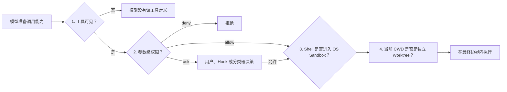
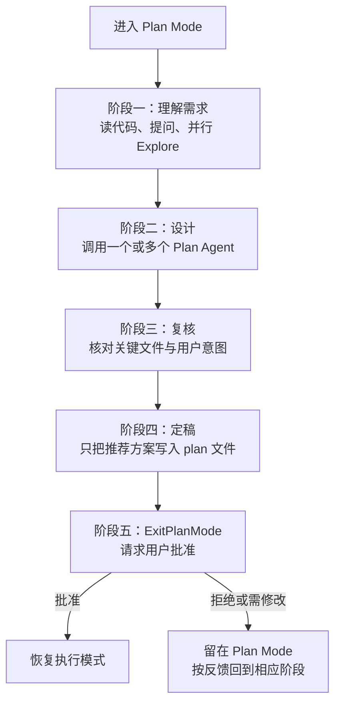

# 模式、权限、Sandbox 与 Worktree

Claude Code 的安全架构不是一个“是否允许”的总开关，而是四个职责不同的边界。前一层通过，不代表后一层失效；把它们混成一个概念，最容易得出“跳过权限就等于关闭沙盒”或“worktree 就是安全容器”这类错误结论。

## 第一层：工具可见性决定模型能提出什么动作

工具池先由内置工具、MCP 工具、平台能力和功能开关组装，再根据主线程或 Subagent、同步或后台、Agent 的 `tools` 与 `disallowedTools`、ToolSearch 延迟加载策略进行投影。只有最终进入 API `tools` 数组的定义，模型才能原生发出对应 `tool_use`。

这一层属于**能力面裁剪**：例如内置 Plan Agent 根本看不到写文件工具，后台 Agent 也看不到不适合异步执行的交互工具。它可以显著缩小误用空间，但不能替代权限检查，因为同一个可见工具的不同参数可能具有完全不同的风险。

## 第二层：权限判断针对一次具体调用

模型给出工具与参数后，运行时才进入参数级权限管线。核心顺序是：

1. 校验工具输入；
2. 匹配整工具与内容级 `deny`、`ask`、`allow` 规则；
3. 让工具执行自己的语义检查，例如路径边界、Shell 子命令和危险配置文件；
4. 应用当前 permission mode；
5. 必要时交给用户、PermissionRequest Hook 或条件启用的分类器；
6. 只有得到 `allow` 才进入真正执行。

显式拒绝优先于方便模式。当前源码中，内容级 `ask`、安全路径检查以及必须与用户交互的工具，都位于普通 bypass 快速放行之前。这说明 permission mode 是默认决策策略，不是抹掉所有硬规则的布尔值。

## Permission modes 各自只改变一部分策略

| 模式 | 架构语义 | 不代表什么 |
|---|---|---|
| `default` | 按规则自动允许安全调用，其余请求用户确认 | 不等于所有操作都询问 |
| `acceptEdits` | 自动允许工作目录范围内通过安全检查的文件编辑 | 不会自动允许任意 Bash、MCP 或目录外写入 |
| `plan` | 把主会话切到规划状态，并配合 Plan 提醒与计划文件通道 | 本身不会从工具池删除所有写工具，也不是 OS 只读沙盒 |
| `dontAsk` | 把原本需要询问的结果直接转成拒绝 | 不是自动允许模式 |
| `bypassPermissions` | 跳过常规权限询问并快速允许，但仍晚于显式规则、内容级询问、安全检查和强交互要求 | 不会关闭 OS Sandbox |

源码还包含条件开放的 `auto`：它用分类器处理原本需要询问的动作，并带连续拒绝控制；这不是对外始终存在的稳定模式。`bubble` 是内部 Agent 权限传递语义，不在用户可选择的模式集合中。

## Plan Mode 是一套会话协议，不只是一个枚举值

模型主动调用 EnterPlanMode 时，需要用户同意。进入后，运行时切换 `permissionMode`，并向对话尾部加入 Plan Mode 元提醒；完整提醒之后会改用稀疏提醒，压缩后还会重新恢复。它在 API 中属于 `user` 角色的 `<system-reminder>` 内容，而不是替换顶层系统 Prompt。

计划文件是一个受控例外：当前会话对应的 plan 路径被识别为内部可编辑路径，主 Agent 可以逐步写计划；其他文件仍由“只读规划”的提醒约束和正常权限管线共同保护。

Plan Mode 并不是文件系统层面的硬只读：当会话原本具有 bypass 能力时，`plan` 模式下的权限管线仍可能沿用快速放行。因此“不要改其他文件”首先是一条会话协议，再叠加工具权限；真正的 OS 强制边界仍属于 Sandbox。

### 标准五阶段

1. **初步理解**：读取相关代码、寻找可复用模式、澄清需求；这阶段要求只使用 Explore 类型 Subagent，并按复杂度选择最少必要数量。
2. **方案设计**：把探索得到的文件路径、调用链、约束与需求交给 Plan Agent；复杂任务可以并行获得多个视角。
3. **方案复核**：主 Agent 自己回读关键文件，检查方案是否符合原始意图，未决问题用 AskUserQuestion 澄清。
4. **最终计划**：主 Agent 把唯一推荐方案写入 plan 文件，标出关键文件、应复用的现有能力和验证方法。当前源码还通过实验分组控制计划长度与结构，但不改变阶段职责。
5. **退出申请**：用 ExitPlanMode 展示计划并请求批准。计划批准不能用普通文本或 AskUserQuestion 代替。

### 条件启用的访谈式实验流

另一条条件路径不强制先集中 Explore、再集中 Design，而是循环执行：

> 探索少量关键文件 → 立即更新计划骨架 → 遇到只能由用户决定的问题就提问 → 带着答案继续探索

第一轮应尽快形成计划骨架并开始访谈，而不是长时间闭门搜索。只有当改什么、改哪些文件、复用什么以及怎样验证都已明确时，才调用 ExitPlanMode。这个实验改变的是**规划编排方式**，不改变“只有 plan 文件可编辑、最终必须显式批准”的边界。

## `permissionMode: plan` 与内置 Plan Agent 必须分开

| 对象 | 它是什么 | 工具边界 | 能否写 plan 文件 | 谁负责退出 |
|---|---|---|---|---|
| 主会话 Plan Mode | 主 Agent 的会话状态与工作协议 | 主工具池仍可能包含写工具；提醒与权限共同约束行为 | 可以 | 主 Agent 调用 ExitPlanMode |
| 内置 Plan Agent | 阶段二中负责提出设计的专用 Subagent | 明确移除 Agent、ExitPlanMode、Edit、Write、NotebookEdit，并使用 Explore 工具集 | 不可以 | 返回设计给主 Agent 后结束 |
| 处于 `plan` permission mode 的普通 Agent | 权限模式被设为 plan 的 Agent 实例 | `ExitPlanMode` 可绕过普通 Subagent 与后台工具过滤，以支持 teammate 的批准流；其他能力仍按 Agent 定义裁剪 | 取决于其可见工具与权限，不由 mode 自动决定 | 依具体运行角色而定 |

最关键的结论是：**Plan Agent 的只读性来自专门的工具裁剪和系统 Prompt；主会话 Plan Mode 的只读规划来自会话提醒、计划文件例外与权限管线。两者不是同一个机制。**

## 第三层：OS Sandbox 约束 Shell 实际能碰什么

参数权限回答“这次调用是否获准”，Sandbox 回答“获准的 Shell 进程在操作系统层面实际能访问什么”。Claude Code 通过 `@anthropic-ai/sandbox-runtime` 适配器把配置转换为文件系统读写限制、网络域名规则、代理与 Unix socket 限制，再包装 Bash 或 PowerShell 命令。

平台边界如下：

- macOS 使用系统 `sandbox-exec` 所代表的 Seatbelt 机制；
- Linux 与 WSL2 使用 bubblewrap，也就是 `bwrap`，网络能力还依赖相应代理组件；
- WSL1 不受支持；
- 原生 Windows 不支持这套 POSIX 沙盒。若策略要求 sandbox 且禁止非沙盒命令，PowerShell 会直接拒绝执行，而不是静默降级。

沙盒只有在设置已启用、平台受支持、平台允许且依赖检查通过时才真正生效。`sandbox.enabled: true` 但环境不可用时：

- `failIfUnavailable: false`（默认）会给出警告，命令可能退回非沙盒执行；
- `failIfUnavailable: true` 把沙盒变成启动硬门槛，REPL 与非交互入口都会拒绝启动。

这一区分非常重要：仅仅在配置中写了“启用”不等于安全边界已经建立，`failIfUnavailable` 才决定“缺依赖时降级”还是“缺边界就失败”。

### 为什么 bypass permission 不等于关闭 sandbox

`bypassPermissions` 只改变第二层的应用级决策。Shell 是否进入沙盒由独立的沙盒选择策略决定，它检查沙盒是否真实启用、该命令是否被排除，以及本次调用是否显式请求 `dangerouslyDisableSandbox` 且组织策略允许非沙盒命令。

因此可以同时出现“应用权限不询问，但命令仍在 Seatbelt/bwrap 内运行”。反方向也成立：某个命令得到普通权限批准，却可能因为平台或依赖不可用而无法获得 OS 沙盒保护。

条件开启 `autoAllowBashIfSandboxed` 时，确定会进入沙盒的 Bash 可以减少应用层常规询问；这只是两层之间的联动优化，不是把权限系统与沙盒合并成一个边界。

## 第四层：Worktree 隔离代码工作区，不隔离操作系统

Worktree 为会话或 Agent 创建独立 Git checkout 和分支，并把其有效 CWD 切到新目录。这样写文件、运行测试和提交默认落在独立工作树里，不直接污染主工作区，也减少并行 Agent 互相覆盖文件的概率。

Claude Code 有两种主要入口：

- 会话级 EnterWorktree/ExitWorktree：整条主会话切入或退出工作树，并同步刷新依赖 CWD 的 Prompt、计划与 Memory 缓存；
- Agent 的 `isolation: "worktree"`：只给该 Agent 一个临时工作树。没有变化时可以自动清理，有变化时保留路径和分支供主 Agent 或用户接管。

删除工作树采用失败关闭：无法可靠判断状态，或发现未提交文件、未合并提交时，不会在没有显式 `discard_changes` 的情况下删除。

但 Worktree 不是安全沙盒。Worktree 机制本身不会创建新的机器、用户身份或进程安全主体；即使其他编排另起进程，也不是 Worktree 提供的隔离。只要权限与 OS Sandbox 允许，Agent 仍可能访问工作树之外的路径。它隔离的是**代码副本、分支和并发写入**，不是凭据、网络、进程或整个文件系统。

## 四层如何共同处理一次危险命令

以 Agent 想在仓库中执行一个会删除文件的 Shell 命令为例：

1. Bash 不在该 Agent 的可见工具集合中，调用根本不会被模型生成；
2. Bash 可见时，命令字符串仍要经过 deny/ask/allow、危险语义和当前模式判断；
3. 调用获准后，若沙盒真实可用，操作系统继续限制它可写的路径和可访问的网络；
4. 若 Agent 位于 worktree，仓库内允许发生的修改落在独立 checkout，而不是主工作区。

每层防御一种不同失败：能力暴露过宽、参数过险、进程越界、并发工作区污染。缺少任何一层，都不能靠另一层完整替代。

## 源码定位

- 主工具池与 Agent 工具裁剪：`src/hooks/useMergedTools.ts`、`src/utils/toolPool.ts`、`src/tools/AgentTool/agentToolUtils.ts`
- 权限模式定义与切换：`src/types/permissions.ts`、`src/utils/permissions/PermissionMode.ts`、`src/utils/permissions/permissionSetup.ts`
- 参数级权限顺序与 bypass 边界：`src/utils/permissions/permissions.ts`、`src/utils/permissions/filesystem.ts`
- Plan Mode 完整提醒、五阶段、访谈流与稀疏提醒：`src/utils/messages.ts`、`src/utils/planModeV2.ts`
- Enter/Exit Plan 的状态转换：`src/tools/EnterPlanModeTool/EnterPlanModeTool.ts`、`src/tools/ExitPlanModeTool/ExitPlanModeV2Tool.ts`
- 内置 Plan Agent 的独立工具边界：`src/tools/AgentTool/built-in/planAgent.ts`
- Sandbox 配置转换、平台与依赖判断：`src/utils/sandbox/sandbox-adapter.ts`、`src/entrypoints/sandboxTypes.ts`
- Shell 是否进入 Sandbox：`src/tools/BashTool/shouldUseSandbox.ts`、`src/tools/PowerShellTool/PowerShellTool.tsx`
- Worktree 生命周期与安全删除：`src/utils/worktree.ts`、`src/tools/EnterWorktreeTool/EnterWorktreeTool.ts`、`src/tools/ExitWorktreeTool/ExitWorktreeTool.ts`
- Agent 独立 worktree：`src/tools/AgentTool/AgentTool.tsx`、`src/tools/AgentTool/runAgent.ts`
