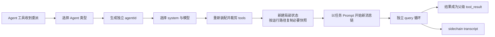

# Subagent 的构造

Subagent 不是主 Agent 换一段人设后继续说话，而是从主运行时派生出的另一条 Agent 查询链。它复用必要的基础设施，但重新决定 system、messages、tools、状态所有权和终止方式。

## 先区分类型、实例和任务

| 概念 | 回答的问题 | 是否可复用 |
|---|---|---|
| Agent 类型 | 这个角色负责什么、允许什么 | 可创建多个实例 |
| Agent 实例 | 这一次真实运行是谁 | 每次独立 `agentId` |
| 运行任务 | 主线现在如何等待、观察或停止它 | 可前台，也可后台 |

同一 Explore 类型可以并发运行多个实例；同一实例从前台转后台，也没有因此变成另一种 Agent 类型。

## 普通 Subagent 的构造链

这条构造链解决了两个矛盾：既要让 Subagent 使用同一套文件、认证和执行基础设施，又不能让它直接改写主 Agent 的对话和当前工具状态。

## system：使用角色规则，不复制主线全文

普通 Subagent 使用所选 Agent 定义的 system，并补充它自己的环境上下文。Explore、Plan 等内置角色还可采用更瘦的上下文策略，避免把与只读任务无关或可能过时的启动快照带入。

它不是主 Agent system 的字节级副本。普通 Subagent 优先获得**职责清晰的独立上下文**，而不是优先命中主线 Prompt cache。

## messages：只接收任务，不共享主对话

普通 Subagent 默认从委派任务开始，**不共享主对话**，也不继承主 Agent 后续收到的新消息。它仍可重新获得当前目录适用的 CLAUDE.md、日期和环境事实，因此“不继承主对话”不等于“没有项目上下文”。

以下内容可在它自己的消息链中增量出现：

- SubagentStart Hook 提供的附加上下文；
- Agent 定义预加载的 Skills；
- 路径触发的嵌套指令与 Memory；
- 工具结果、任务通知，以及在该实例可由注册名或合法 `agentId` 寻址时专门发给它的消息。

父级只在自己的 transcript 中保留 Agent 工具调用、进度和最终结果，不把子链的全部思考与工具历史平铺进主对话。

## tools：重新装配，不照抄父级

普通 Subagent 会按自己的权限模式重新获得候选池，再应用内置 Subagent 边界、Agent `tools` / `disallowedTools` 和前后台规则。因此父级看得见某个工具，不代表子级也看得见；父级工具被临时裁剪，也不必然改变 worker 的候选来源。

同步 Subagent 可以使用比后台 Subagent 更宽的交互能力；后台实例会进一步移除需要主 UI、递归扩张或主线控制权的工具。Agent 自己声明的 MCP Server 则走专属后置增量路径，仍受调用时权限控制。

## 读取状态：普通 Agent 从空开始，Fork 才复制父级快照

普通 Subagent 不带父级消息前缀，因此从空的读取文件状态开始；它在自己的查询链中重新建立“读过什么、之后是否变化”。这避免父 Agent 的读取事实被误当成子 Agent 已经亲自观察过。

它的内容替换状态仍从父上下文复制成独立容器，但因为普通 Subagent 没有父级消息中的工具调用标识，这份快照通常没有对象可匹配。复制容器不等于继承父对话语义。

Fork 不同：它复制父级消息前缀，所以同时复制父级读取状态和内容替换决策，保证旧工具结果在两条链中的投影一致。复制后仍各自推进，不共享同一个可变容器。

它还会新建：

- Agent 身份与查询追踪链；
- 嵌套 Memory、Skill 发现和调用状态；
- 专属消息数组与 sidechain transcript；
- Agent 自己创建的 MCP 连接与清理责任；
- 工具拒绝计数、进度和局部取消资源。

主线 UI 控制回调通常不向后台 Agent 开放，但任务注册仍必须能到达根任务表，否则后台 Shell 或 Agent 将无法被观察和终止。这是“隔离普通状态、保留生命周期控制”的精妙分层。

## 同步与后台改变的是调度所有权

### 同步 Subagent

主 Agent 的当前工具回合等待它结束，结果直接成为 Agent 工具的 `tool_result`。它通常与父回合共享取消命运，也可以把权限确认冒泡到交互界面。

### 后台 Subagent

主 Agent 先得到任务标识，随后通过任务通知、TaskOutput 或定向消息取得进展和结果。定向消息要求目标仍能由注册名或合法 `agentId` 解析；运行中进入内存待处理队列，停止后只有 sidechain transcript 仍存在时才能尝试续跑。后台任务使用独立取消器；主线一次 ESC 不会自动杀死它，需要显式 TaskStop 或生命周期清理。

前台任务被转为后台时，当前源码的可观察语义是以原始任务参数重新启动后台查询，不是把正在生成的内存上下文无缝搬过去。因此“转后台”不应被理解为冻结并迁移同一个调用栈。

## Fork 是另一种构造策略

Fork 仅在构建能力开启、交互入口且非协调器等条件满足时存在。它的目标不是角色隔离，而是**复制主线请求前缀并最大化缓存复用**：

- 优先复用父级已渲染的 system 字节；如果该快照缺失则回退重建，此时字节同一性只是最佳努力；
- 复制父级历史和当前完整工具批次；
- 精确继承 tools、模型、thinking 与交互标志；
- 克隆读取和内容替换决策，分叉后各自推进；
- 追加只属于当前 Fork 的末尾任务指令。

Fork 不等于共享 live conversation。创建以后，父级新消息不会自动流入 Fork，Fork 的新消息也不会写回父级历史。它共享的是**创建时前缀**，不是持续可变状态。

## 作用域化 CWD 与 Worktree 是两件事

普通 Subagent 与 Fork 默认仍操作同一 checkout。显式 CWD 覆盖只改变该 Agent 异步链看到的有效目录，目标可以是同一 checkout 的子目录或任意已有目录；它不会创建工作副本。

只有 `isolation: worktree` 才创建另一 checkout，并沿该 Agent 的异步链把 CWD 覆盖到那里。它不会自动复制进程、认证、MCP、环境变量或外部服务。任务结束时，无变化的临时工作树可清理；存在修改、提交或无法安全判断时应保留并把路径返回父级。

Fork 叠加 Worktree 时，继承前缀里的路径和读取快照仍来自父 checkout，因此运行时会追加路径翻译和重新读取提醒。Worktree 提供文件副本，不能让旧上下文天然变成新副本的事实。

## 结果、记录与清理

一次 Subagent 结束时需要完成三件事：

1. 将最终文本、错误或取消事实投影为父级可消费的结果；
2. 把完整子链写入父 session 下独立的 sidechain，以支持查看和条件续跑；
3. 清理 Agent 专属 MCP、Skill 调用状态、Hook、取消监听和临时 worktree。

父级得到的是经过边界收敛的结果，不是子 Agent 整个内存堆。这使委派既可审计，又不会把主上下文迅速撑大。

## 源码定位

- Agent 选择与调度：`src/tools/AgentTool/AgentTool.tsx`
- Subagent 构造与生命周期：`src/tools/AgentTool/runAgent.ts`
- 工具裁剪：`src/tools/AgentTool/agentToolUtils.ts`、`src/constants/tools.ts`
- 状态克隆与 Fork 查询：`src/utils/forkedAgent.ts`
- Fork 路由：`src/tools/AgentTool/forkSubagent.ts`
- 后台 Agent 任务：`src/tasks/LocalAgentTask/`
- sidechain 与恢复：`src/utils/sessionStorage.ts`、`src/tools/AgentTool/resumeAgent.ts`
