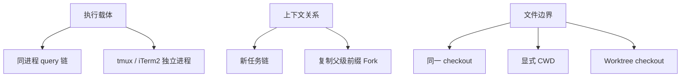
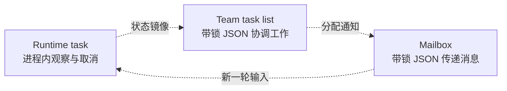

# 多代理协作

Claude Code 的“多代理”不是一个模式，而是几种解决不同问题的机制。理解它们最好的方式，是把执行载体、上下文继承和文件隔离看成三条正交轴。

## 三条轴决定真实拓扑

“后台”只描述等待方式，“Team”只描述协调域，“Worktree”只描述工作副本。任何一个词都不能单独推出另外两条轴。

## 六种协作形态解决六类问题

| 形态 | 主要解决的问题 | 默认上下文 | 默认文件边界 |
|---|---|---|---|
| 同步 Subagent | 当前回合中的专门委派 | 新消息链 | 同一 checkout |
| 后台 Subagent | 让主线与长任务在时间上解耦 | 新消息链 | 同一 checkout |
| Fork | 并行利用主线完整前缀与 Prompt cache | 复制父级前缀 | 同一 checkout |
| 同进程 teammate | 长期、有名字的协作者与共享任务协调 | 独立长期历史 | 同一 checkout |
| pane teammate | 独立进程、独立 UI 的长期协作者 | 独立会话 | 默认同一路径 |
| Worktree Agent | 避免多个写任务直接争用同一工作副本 | 取决于所叠加 Agent | 独立 checkout |

普通同步/后台 Subagent、Fork 和同进程 teammate 都复用当前进程里的 Agent 查询能力。只有 tmux / iTerm2 teammate 启动完整的新 Claude Code 进程。

## TeamCreate 建立协调域，不直接创建队友

Agent Teams 条件启用时，TeamCreate 负责建立：

- team 配置和 leader 身份；
- 共享任务列表的命名空间；
- mailbox 的命名空间与寻址基础；成员 inbox 文件在首次实际写入时按需建立；
- leader 侧的团队控制状态。

真正的 teammate 由带 `name` 和 team 上下文的 Agent 委派创建。团队拓扑是扁平的：teammate 不能再生成 teammate；同进程 teammate 可在受限条件下使用同步 Subagent，但不能无限生成后台层级。

## 同进程 teammate：长期 runner，而非一次工具调用

同进程 teammate 有自己的团队身份、累积消息历史、每轮查询和压缩节奏。它使用主 Agent 基础 system 加 teammate 协议补充，再按可选自定义 Agent 收窄职责。

它不继承 leader 对话。初始任务直接交给 runner；后续消息通过共享 mailbox 到达。普通最终文本也不会自动出现在 leader 对话中，teammate 必须用 SendMessage 把需要共享的结论发回。

这种设计刻意避免“所有人的完整历史互相广播”。共享的是任务和必要消息，私有的是每个 Agent 的推理链。

## pane teammate：协作协议跨过进程边界

tmux / iTerm2 teammate 是完整新进程，拥有自己的 AppState、查询循环、缓存、MCP 生命周期、Skill 状态、取消器和 transcript。leader 只保存观察与控制镜像。

初始任务不塞进进程启动命令，而是由 mailbox 投递。这使第一条任务和后续协作消息遵循同一寻址协议，也避免把任意 Prompt 暴露在命令行参数中。

新进程独立初始化。spawn 会显式传入已经解析的模型：只有配置选择 `inherit` 或 teammate 默认策略跟随 leader 时，才使用 leader 当前模型；否则可以是单独指定或默认模型。权限也只转发被支持的选定模式，Plan 约束走独立的 required-plan 协议。必要配置／代理变量按白名单转发，不能笼统说它复制了父进程全部环境。`parentSessionId` 只建立血缘和记录关联，不会共享 API conversation 或 Prompt cache。

## 三个“任务”平面必须分开

### Runtime task

位于各进程的 AppState，用来观察后台 Agent、Shell、远程任务和 teammate，适合 UI 进度与取消。它不是跨进程数据库。

### Team task list

位于共享配置目录，TaskCreate / TaskUpdate / TaskList 通过文件锁协调 owner、blocker、完成状态与认领。它才是 team 中可跨进程读取的工作清单。

### Mailbox

同样位于共享配置目录，SendMessage、任务分配和 shutdown 协议通过它寻址。读、写和标记已读都要避免并发覆盖；只有消息已提交给 Agent 或可靠进入本地队列后，才应标记已读。

普通后台 Subagent 的定向消息不是 team mailbox：目标能被注册名或合法 `agentId` 寻址时，运行中使用进程内 pending messages；结束后只有 transcript 仍存在才可尝试 sidechain resume。两者都叫“发消息”，却属于不同持久化平面。

## 前后台通知遵循优先级

后台 Agent 完成后先把任务置为终态，让等待者立即解锁；分类、Git 检查和通知美化可以随后处理。完成通知进入主命令队列时优先级低于真实用户输入，避免一批后台结果让用户的新需求饿死。

Team mailbox 同样有消费优先级：shutdown 与 leader 指令应高于普通 peer chatter，空闲 teammate 才尝试领取未阻塞任务。

## 取消有三种粒度

| 粒度 | 影响 |
|---|---|
| 主线回合取消 | 终止当前 leader turn；同步 Subagent 通常随之终止 |
| teammate 当前工作取消 | 停止这一轮，teammate 回到 idle 等待下一条消息 |
| Agent 生命周期终止 | 结束后台任务、runner 或独立 pane |

后台 Subagent 和 teammate 通常拥有独立生命周期，所以 leader 按一次 ESC 不等于全团队关机。Fork 在正常启用后台能力时被强制异步并使用独立取消器；如果全局关闭后台任务而退回同步，它会随父回合取消。跨进程 teammate 的优雅退出还是一个 mailbox 请求／同意协议；强制关闭才由 pane backend 执行。

## Worktree 不会由 Team 自动提供

Team 当前创建队友的路径默认使用 leader 的工作目录，不会因为“多人协作”自动建 worktree。多个 teammate 因此可能同时修改同一文件。

需要文件隔离时，必须显式选择 Agent worktree 或其他独立 CWD。Worktree 只隔离 checkout 和分支，仍共享 Git object store、配置目录、网络和外部系统；它不是容器。

## 值得注意的条件边界

- Agent Teams、Fork、后台自动化和某些 teammate backend 都是条件启用能力；源码存在不代表当前产品形态必定可见。
- 全局关闭后台任务时，原本会异步的路径也可能退回同步。
- SendMessage 对普通后台 Agent 的续跑能力依赖工具可见、目标可寻址，并且停止后的 sidechain transcript 仍存在。
- 同进程 EnterWorktree 改变的是 session 级工作目录，不应拿它代替 Agent 专属的异步 CWD 隔离。
- 从前台转后台是调度重启边界，不是上下文无损迁移。

## 源码定位

- Team 建立与开关：`src/tools/TeamCreateTool/`、`src/utils/agentSwarmsEnabled.ts`
- teammate 创建：`src/tools/shared/spawnMultiAgent.ts`
- 同进程 runner：`src/utils/swarm/spawnInProcess.ts`、`src/utils/swarm/inProcessRunner.ts`
- pane backend：`src/utils/swarm/backends/`
- 团队任务：`src/utils/tasks.ts`、`src/tools/TaskCreateTool/`、`src/tools/TaskUpdateTool/`
- mailbox：`src/utils/teammateMailbox.ts`、`src/hooks/useInboxPoller.ts`
- 普通后台任务与消息：`src/tasks/LocalAgentTask/`、`src/utils/messageQueueManager.ts`
- Worktree：`src/utils/worktree.ts`、`src/utils/cwd.ts`
