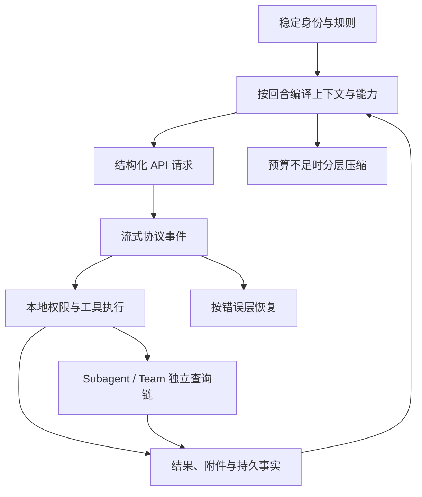

# 最值得复用的精妙设计

Claude Code 的价值不在于“接上模型和工具”这一表层组合，而在于它如何处理动态上下文、硬权限、长会话和并发 Agent。下面这些设计可以迁移到其他 Agent 系统。

## 一、把 Agent 拆成七个可独立演化的输入

Agent 不是一个 Prompt，而是身份、指令、上下文、能力、模型策略、权限和可变状态的组合。任何一项变化都不要求重建其他所有层。

这使“换角色”“换模型”“进入 Plan Mode”“发现新工具”和“恢复会话”成为不同的状态转移，而不是不断复制一份越来越大的 Agent 配置。

## 二、用四个运行平面隔离职责

控制面决定下一步，模型面负责推理，执行面把工具意图变成现实动作，持久化面保存需要恢复的事实。模型无法直接执行本地操作，UI 状态也不会自动变成 API 字段。

这条边界让安全、恢复和多 Agent 不必侵入模型协议本身。

## 三、稳定 Prompt 前缀与动态状态分离

身份、原则和通用工具方法尽量放在稳定前部；日期、文件变化、Plan、Skill 和任务消息按时点进入后部。物理缓存作用域再根据默认标记、调用资格和用户 MCP 信任边界决定。

关键取舍是：先为缓存创造稳定前缀，但不把“内容稳定”误写成“一定获得全局缓存”。

## 四、把上下文当成编译产物

内部 transcript、system context、初始 user context 和运行时附件走不同入口，最终才投影成合法的 `system[]` 与 `messages[]`。

这种编译层可以过滤 UI 事件、重排附件、合并角色、修复工具配对并重建压缩后的状态。模型协议因此不需要承担本地运行时的全部复杂度。

## 五、以真实协议事件驱动状态机

主循环根据是否真正收到 `tool_use` 决定进入工具回合，而不是只相信 stop reason。流式摘要字段可能迟到或缺失，已经观测到的内容块才是可靠事实。

这是一条通用原则：长连接系统应让状态转移依赖可验证事件，而不是依赖最终统计标签。

## 六、分开“模型看得见”和“本次允许执行”

工具可见性先缩小模型的决策空间；具体调用再按参数匹配 deny、ask、allow 与工具语义；本地进程在适用时继续受 OS Sandbox。

因此一个 Bash 工具可以可见，但某条命令仍被拒绝。粗粒度能力图提高决策质量，细粒度权限保留灵活性。

## 七、工具来源允许非对称装配

基础工具池按 worker 自己的模式重建和裁剪；Agent 专属 MCP 在基础裁剪后增量加入；Fork 则为了缓存精确继承父工具快照。

三种路径服务不同目标：普通 Agent 优先能力隔离，专属 MCP 优先角色扩展，Fork 优先请求前缀复用。用一条统一交集表达它们反而会丢失架构事实。

## 八、用 ToolSearch 渐进暴露能力

初始请求只常驻核心工具；延迟工具先公布名称与可发现性，模型搜索后，完整 schema 才进入后续请求。

这样既避免海量 MCP schema 挤占上下文，又不牺牲能力发现。ToolSearch 搜的是“可调用能力”，不是文件、代码或网页内容。

## 九、为工具回合设置三层配对保障

正常执行层为每个 `tool_use` 产生结果；中断和恢复层为半途调用补错误结果；API 边界再清理孤立、重复或不合法配对。

它把“正常语义完整”“异常可恢复”和“出网协议合法”分开负责，比把所有补救压在执行器里更稳健。

## 十、错误恢复按失败层分流

连接与限流由请求 retry 处理；流式链路问题可转非流；持续模型不可用才触发模型降级；Prompt 过长、输出截断等语义错误由主回合改变上下文后继续。

分层恢复只替换必要状态，减少重复外部副作用。工具失败则作为环境事实返给模型，而不是默认在本地悄悄重放。

## 十一、压缩与 Prompt cache 联合设计

Claude Code 先限制大工具结果，再做局部清理和微压缩，随后才完整摘要；真实超限后还有一次响应式恢复。压缩后重新附加仍有效的 Plan、Skill、任务和指令。

压缩不是“历史变短”这么简单，而是在语义连续、工具协议、缓存前缀和恢复成本之间做状态重建。

## 十二、多 Agent 只共享必要资源

普通 Subagent 不共享主对话，却可使用同一物理文件；Fork 复制父级请求前缀，却不共享分叉后的可变状态；pane teammate 有独立进程，却默认仍可能操作同一目录。

身份与 CWD 跟随异步链，读取缓存和替换决策复制后独立，任务与 mailbox 按跨进程需要持久化。这比“每个 Agent 完整复制一套环境”成本更低，也比“所有 Agent 共用全局状态”更安全。

## 十三、把观察、协调和消息拆成三个平面

Runtime task 负责进程内进度与取消，Team task list 负责跨进程工作分配，mailbox 负责有地址的消息传递。后台 Subagent 的 pending queue 又与 Team mailbox 分开。

这避免 UI 镜像被误当作任务真相，也避免“发送消息”与“修改任务 owner”耦合成同一种存储操作。

## 十四、功能存在与运行时可用严格区分

一个工具、Fork、Agent Teams、自动记忆提取或压缩模块出现在源码中，不代表当前构建、平台、模型和会话一定启用。教程和 Agent 本身都必须保留条件语气。

这是最容易忽略、也最值得复用的工程纪律：**描述当前真实能力图，而不是源码目录的理论上限。**

## 一张总图

## 源码定位

- Prompt 与上下文：`src/constants/prompts.ts`、`src/context.ts`、`src/utils/messages.ts`
- 查询状态机：`src/query.ts`
- API 请求与缓存：`src/services/api/claude.ts`、`src/utils/api.ts`
- 工具能力与权限：`src/tools.ts`、`src/utils/toolSearch.ts`、`src/utils/permissions/`
- 工具执行与恢复：`src/services/tools/`、`src/services/api/withRetry.ts`
- 压缩：`src/services/compact/`
- 多 Agent：`src/tools/AgentTool/`、`src/utils/swarm/`
- 持久化：`src/utils/sessionStorage.ts`、`src/utils/tasks.ts`、`src/utils/teammateMailbox.ts`

